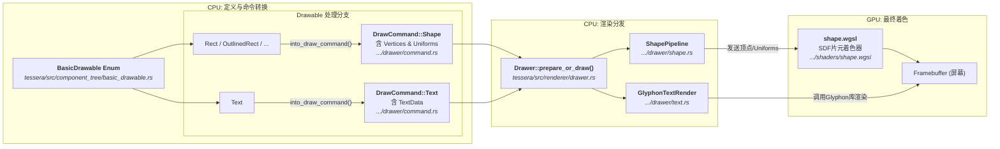

## 起因

起因是我希望把 tessera 的渲染管线和渲染指令由内置改为由组件库自己注册管线和指令。

之前的架构中组件是这样来的

<!--more-->


这样的架构导致渲染管线和指令是内置的，无法扩展，组件库只能组合basic drawable实现ui。

那么将渲染管线和指令改为可注册的动态分发架构，组件库就可以注册自己的管线和指令，这也是为以后更复杂的效果需要离屏渲染做准备。

所以我立马着手改造。首先把管线和指令改为trait:

```rust
pub trait DrawablePipeline<T: DrawCommand> {
    fn begin_pass(
        &mut self,
        gpu: &wgpu::Device,
        gpu_queue: &wgpu::Queue,
        config: &wgpu::SurfaceConfiguration,
        render_pass: &mut wgpu::RenderPass<'_>,
    ) {
    }

    fn end_pass(
        &mut self,
        gpu: &wgpu::Device,
        gpu_queue: &wgpu::Queue,
        config: &wgpu::SurfaceConfiguration,
        render_pass: &mut wgpu::RenderPass<'_>,
    ) {
    }

    fn draw(
        &mut self,
        gpu: &wgpu::Device,
        gpu_queue: &wgpu::Queue,
        config: &wgpu::SurfaceConfiguration,
        render_pass: &mut wgpu::RenderPass<'_>,
        command: &T,
        size: [Px; 2],
        start_pos: PxPosition,
    );
}

// ...

/// Every draw command is a command that can be executed by the drawer.
pub trait DrawCommand: Send + Sync {
    // DrawCommand由管线自己处理，主要就是一个标记作用
}
```

接下来我们renderer肯定就要持有这些管线了，这在rust的唯一解当然是保存一组trait object，就像这样：

```rust
// Renderer...其它字段
pub pipelines: Vec<Box<dyn DrawablePipeline<dyn DrawCommand>>>,
```

> 接下来的代码演示都是用一个简单的例子模拟的，所以报错的符号可能和描述对不上，但是逻辑是一样的。
> 
> 对了，我使用的是[rust-script](https://github.com/fornwall/rust-script)来快速运行这个例子的，对这种场景它非常方便。

然后就尴尬了，rustc直接给你一巴掌：

```bash
error[E0277]: the size for values of type `(dyn t + 'static)` cannot be known at compilation time
  --> testa.rs:15:6
   |
15 | impl a<dyn t> for b {}
   |      ^^^^^^^^ doesn't have a size known at compile-time
   |
   = help: the trait `Sized` is not implemented for `(dyn t + 'static)`
```

这是因为Rust的trait object需要一个具体的类型来计算大小，而`dyn DrawCommand`是一个trait object，它的大小在编译时是未知的。

好，那我直接Box起来，让它变为固定大小的指针试试：

```rust
// Renderer...其它字段
pub pipelines: Vec<Box<dyn DrawablePipelineBox<dyn DrawCommand>>>,
```

这次就过了，但是我们得到了一大堆Box，还要为Boxed的版本实现trait。还有一个问题是，怎么分发？

## 类型擦除的动态分发

这显然在绕远路。问题出在泛型上。`DrawablePipeline<T>` 这个 `trait` 本身是泛型的，而 `trait object` 不支持泛型 `trait` 本身。我们需要一个具体的、非泛型的 `trait` 来放入 `Vec` 中。

解决方案是引入一个中间层。一个非泛型的 `trait`，我们称之为 `ErasedDrawablePipeline`。它的作用就是“擦除”具体 `DrawCommand` 的类型信息，统一调用接口。

它的 `draw` 方法看起来是这样的：

```rust
fn draw_erased(
    &mut self,
    // ... 其他参数
    command: &dyn DrawCommand, // 注意这里，它接收一个 trait object
    // ...
) -> bool; // 返回一个bool值，告诉调用者它是否处理了这个command
```

但我们怎么从 `&dyn DrawCommand` 拿回我们具体的命令类型呢？答案是 `std::any::Any`。`Any` trait 允许我们在运行时进行动态类型检查和向下转换（downcasting）。

所以，我们可以定义一个包装结构体 `DrawablePipelineImpl`，它持有我们真正的、具体的 `Pipeline`。然后，我们为这个包装结构体实现 `ErasedDrawablePipeline`。在 `draw_erased` 方法内部，我们尝试把 `&dyn DrawCommand` 向下转换成我们这个管线实现所知道的具体命令类型 `T`。

- 如果 `downcast_ref` 成功，说明传入的 `command` 正是这个具体管线能处理的类型 `T`！于是我们就可以调用内部真正的 `pipeline.draw()` 方法。并返回 `true`。
- 如果失败，就说明不是，我们什么都不做，返回 `false`，让外层调用者继续尝试下一个管线。

有了这个机制，我们就可以创建一个 `PipelineRegistry` 来统一管理所有的管线了。

- `PipelineRegistry` 内部持有一个 `Vec<Box<dyn ErasedDrawablePipeline>>`。这回编译器就满意了，因为 `ErasedDrawablePipeline` 是一个非泛型的、大小确定的 `trait`。
- 当注册一个新的管线时，我们用 `DrawablePipelineImpl` 把它包起来，转换成 `Box<dyn ErasedDrawablePipeline>`，然后存入 `Vec`。在这个过程中，具体的管线类型 `P` 和它处理的指令类型 `T` 就被“擦除”了，统一由 `ErasedDrawablePipeline` 这个 `trait object` 来表示。
- 分发时，`dispatch` 方法遍历所有“已擦除”的管线，调用它们的 `draw_erased` 方法。一旦有一个返回 `true`，就表示找到了能处理该指令的管线，任务完成。
- 如果遍历完都没有找到，就说明开发者忘了注册对应的管线，此时 `panic` 是合理的，可以尽早暴露问题。

最终的实现如下：

```rust
use std::any::{Any, TypeId};

use crate::{Px, PxPosition, renderer::DrawCommand};

pub trait DrawablePipeline<T: DrawCommand> {
    fn begin_pass(
        &mut self,
        gpu: &wgpu::Device,
        gpu_queue: &wgpu::Queue,
        config: &wgpu::SurfaceConfiguration,
        render_pass: &mut wgpu::RenderPass<'_>,
    ) {
    }

    fn end_pass(
        &mut self,
        gpu: &wgpu::Device,
        gpu_queue: &wgpu::Queue,
        config: &wgpu::SurfaceConfiguration,
        render_pass: &mut wgpu::RenderPass<'_>,
    ) {
    }

    fn draw(
        &mut self,
        gpu: &wgpu::Device,
        gpu_queue: &wgpu::Queue,
        config: &wgpu::SurfaceConfiguration,
        render_pass: &mut wgpu::RenderPass<'_>,
        command: &T,
        size: [Px; 2],
        start_pos: PxPosition,
    );
}

pub trait ErasedDrawablePipeline {
    fn begin_pass(
        &mut self,
        gpu: &wgpu::Device,
        gpu_queue: &wgpu::Queue,
        config: &wgpu::SurfaceConfiguration,
        render_pass: &mut wgpu::RenderPass<'_>,
    );

    fn end_pass(
        &mut self,
        gpu: &wgpu::Device,
        gpu_queue: &wgpu::Queue,
        config: &wgpu::SurfaceConfiguration,
        render_pass: &mut wgpu::RenderPass<'_>,
    );

    fn draw_erased(
        &mut self,
        gpu: &wgpu::Device,
        gpu_queue: &wgpu::Queue,
        config: &wgpu::SurfaceConfiguration,
        render_pass: &mut wgpu::RenderPass<'_>,
        command: &dyn DrawCommand,
        size: [Px; 2],
        start_pos: PxPosition,
    ) -> bool;
}

struct DrawablePipelineImpl<T: DrawCommand, P: DrawablePipeline<T>> {
    pipeline: P,
    _marker: std::marker::PhantomData<T>,
}

impl<T: DrawCommand + 'static, P: DrawablePipeline<T> + 'static> ErasedDrawablePipeline
    for DrawablePipelineImpl<T, P>
{
    fn begin_pass(
        &mut self,
        gpu: &wgpu::Device,
        gpu_queue: &wgpu::Queue,
        config: &wgpu::SurfaceConfiguration,
        render_pass: &mut wgpu::RenderPass<'_>,
    ) {
        self.pipeline
            .begin_pass(gpu, gpu_queue, config, render_pass);
    }

    fn end_pass(
        &mut self,
        gpu: &wgpu::Device,
        gpu_queue: &wgpu::Queue,
        config: &wgpu::SurfaceConfiguration,
        render_pass: &mut wgpu::RenderPass<'_>,
    ) {
        self.pipeline.end_pass(gpu, gpu_queue, config, render_pass);
    }

    fn draw_erased(
        &mut self,
        gpu: &wgpu::Device,
        gpu_queue: &wgpu::Queue,
        config: &wgpu::SurfaceConfiguration,
        render_pass: &mut wgpu::RenderPass<'_>,
        command: &dyn DrawCommand,
        size: [Px; 2],
        start_pos: PxPosition,
    ) -> bool {
        if let Some(cmd) = (command as &dyn Any).downcast_ref::<T>() {
            self.pipeline
                .draw(gpu, gpu_queue, config, render_pass, cmd, size, start_pos);
            true
        } else {
            false
        }
    }
}

pub struct PipelineRegistry {
    pub(crate) pipelines: Vec<Box<dyn ErasedDrawablePipeline>>,
}

impl PipelineRegistry {
    pub fn new() -> Self {
        Self {
            pipelines: Vec::new(),
        }
    }

    pub fn register<T: DrawCommand + 'static, P: DrawablePipeline<T> + 'static>(
        &mut self,
        pipeline: P,
    ) {
        let erased = Box::new(DrawablePipelineImpl::<T, P> {
            pipeline,
            _marker: std::marker::PhantomData,
        });
        self.pipelines.push(erased);
    }

    pub(crate) fn begin_all_passes(
        &mut self,
        gpu: &wgpu::Device,
        gpu_queue: &wgpu::Queue,
        config: &wgpu::SurfaceConfiguration,
        render_pass: &mut wgpu::RenderPass<'_>,
    ) {
        for pipeline in self.pipelines.iter_mut() {
            pipeline.begin_pass(gpu, gpu_queue, config, render_pass);
        }
    }

    pub(crate) fn end_all_passes(
        &mut self,
        gpu: &wgpu::Device,
        gpu_queue: &wgpu::Queue,
        config: &wgpu::SurfaceConfiguration,
        render_pass: &mut wgpu::RenderPass<'_>,
    ) {
        for pipeline in self.pipelines.iter_mut() {
            pipeline.end_pass(gpu, gpu_queue, config, render_pass);
        }
    }

    pub(crate) fn dispatch(
        &mut self,
        gpu: &wgpu::Device,
        gpu_queue: &wgpu::Queue,
        config: &wgpu::SurfaceConfiguration,
        render_pass: &mut wgpu::RenderPass<'_>,
        cmd: &dyn DrawCommand,
        size: [Px; 2],
        start_pos: PxPosition,
    ) {
        for pipeline in self.pipelines.iter_mut() {
            if pipeline.draw_erased(gpu, gpu_queue, config, render_pass, cmd, size, start_pos) {
                return;
            }
        }

        panic!(
            "No pipeline found for command {:?}",
            std::any::type_name_of_val(cmd)
        );
    }
}
```

## 反思与总结

这个方法显然优点和缺点都有。

### 优点

1.  **高度解耦和可扩展性**：这是最大的优点。渲染器核心（`PipelineRegistry`）不再关心任何具体的渲染管线实现，它只与抽象的 `ErasedDrawablePipeline` 交互。这使得任何组件库都可以定义自己的 `DrawCommand` 和 `DrawablePipeline`，然后注册进来，实现了真正的“插件式”架构。
2.  **保留了大部分静态类型安全**：在每个具体的 `DrawablePipeline<T>` 实现内部，`command` 的类型是 `&T`，是具体的、静态的。所有的类型转换和检查都被巧妙地封装在了 `DrawablePipelineImpl` 的 `draw_erased` 方法里，开发者在使用具体的管线时，无需关心动态分发的细节。

### 问题与权衡

1.  **运行时开销**：分发 (`dispatch`) 的过程是一个线性的循环。在最坏的情况下，如果需要执行的指令对应的管线在列表的最后一个，或者干脆不存在，那么就需要遍历整个 `Vec`，其时间复杂度是 O(n)，其中 n 是注册管线的数量。对于UI渲染这种每秒需要执行成千上万次分发的场景，如果管线数量很多，这里的性能损耗是需要考虑的。
2.  **实现略显繁琐**：相比于简单的 `enum` 匹配，这种方法需要额外定义 `ErasedDrawablePipeline` trait 和 `DrawablePipelineImpl` 包装结构体，增加了代码量和理解成本。这是一种为了获得极高灵活性而付出的复杂度代价。

### 关于Rust限制的思考

问题的根源在于 Rust 的 `trait object` 机制。`trait object`是通过虚函数表（vtable）实现的，为了让编译器能够确定 vtable 的大小和布局，`trait` 本身不能是泛型的。`DrawablePipeline<T>` 作为一个泛型 trait，无法直接变成 `dyn DrawablePipeline` 这样的 `trait object`。

也许在未来泛型会有更灵活的处理方式，类似c++的模板元编程，实现真正的"0成本抽象"。虽然这也许不是一件好事，但是至少在这里，它会让我们的实现更容易。
