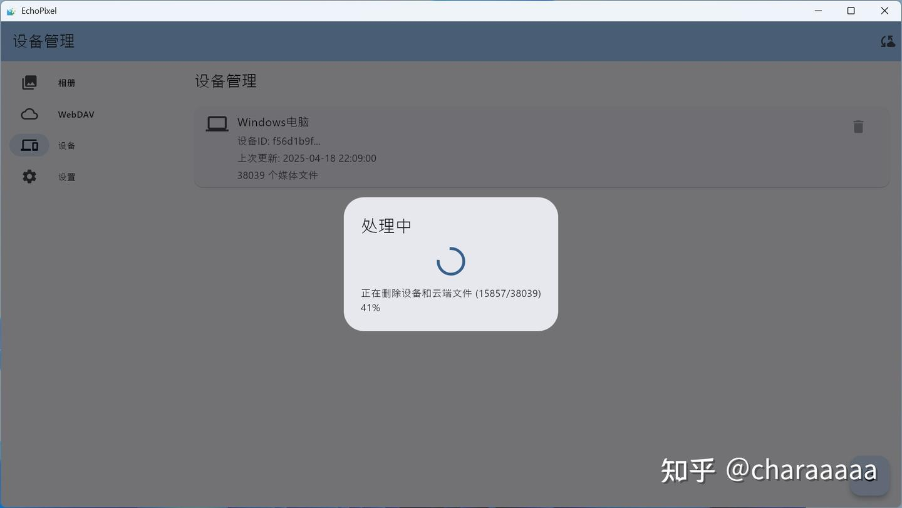
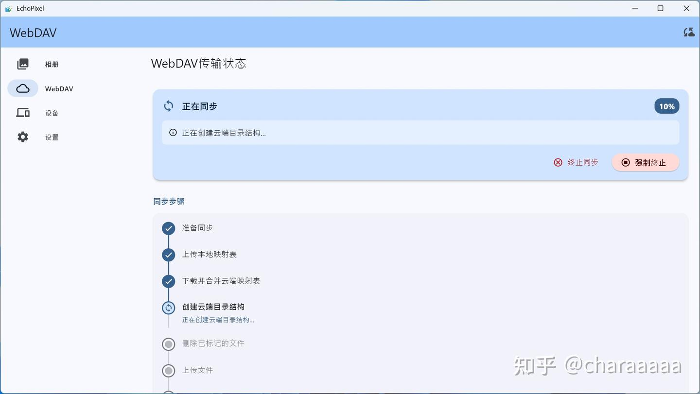

⚠️ **WARNING** ⚠️:  
BETA 版本，未经充分测试

<!--more-->

## 项目简介

多平台同步相册，纯客户端实现(支持 webdav)  
项目 GPLv3 开源，欢迎 pr

**仓库地址:**  
[GitHub - shadow3aaa/echo_pixel](https://github.com/shadow3aaa/echo_pixel)

## 平台适配情况

- **Windows**: 测试过同步、删除设备功能
- **Android**: 测试过同步、删除设备功能
- **macOS**: 未经过任何测试运行，急需测试者(其实我不急，因为我没有)

## 下载链接

[Releases · shadow3aaa/echo_pixel](https://github.com/shadow3aaa/echo_pixel/releases)

## 功能展示

### 主界面

### 删除设备

支持保留云端图片或者一起删除

### 同步状态显示

