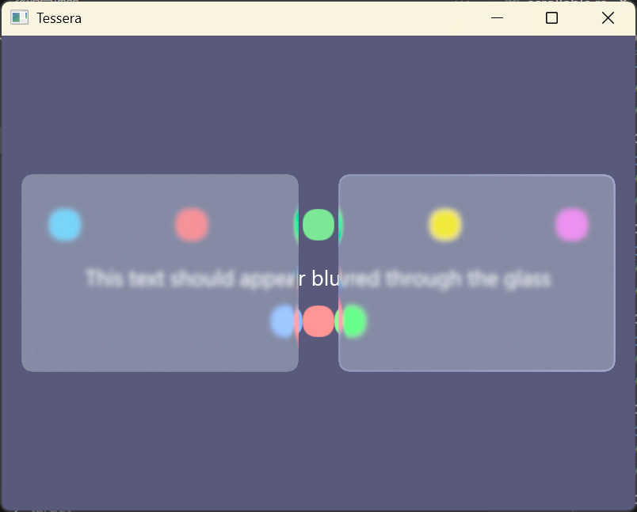
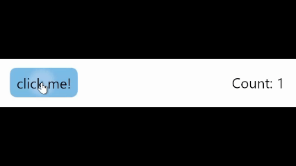
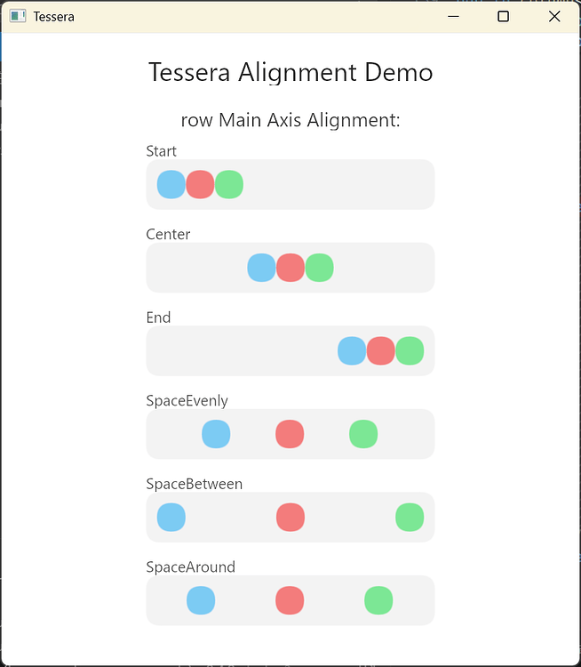
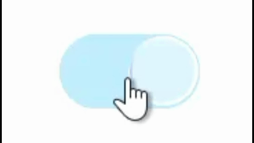
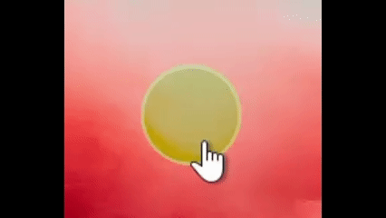
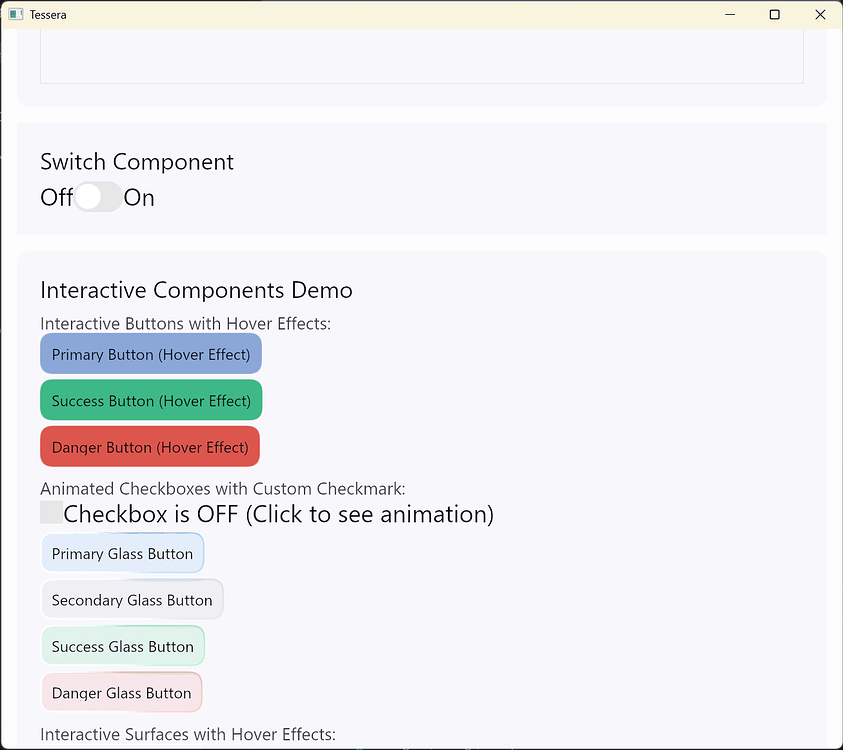

我很高兴地宣布 Tessera UI v1.0.0 正式发布。不过，请不要被版本号误导，这仍然是 Tessera UI 的测试版。虽然还有很多工作要做<!--more-->，但随着核心功能、基础组件和设计的逐步稳定，我认为现在是发布的最佳时机。

## 什么是 Tessera UI？

Tessera UI 是一个基于 Rust 和 wgpu 的即时模式 UI 框架。你可能会问：已经有了像 egui、iced 和 gpui 这样成熟的框架，为什么还要重新造轮子？答案是主观的，但在我看来，这是因为我相信 Tessera UI 的设计代表了通用 UI 未来的正确方向。待我娓娓道来。

### 着色器是一等公民

在 Tessera 中，着色器是一等公民。Tessera 的核心没有像“画刷”这样的内置绘制图元。相反，它提供了一个易于使用的 WGPU 渲染/计算管线插件系统，提供了更接近某些游戏引擎的体验。这是有意为之的：

- **WGPU 的降临**：WGPU 和 WGSL 的出现使着色器编程变得更简单、更高效，并且可以轻松适应主流的 GPU 后端。直接编写着色器不再是一个痛苦的过程。
- **新拟物化 (Neumorphism)**：近年来，纯粹的扁平化设计已导致视觉疲劳，越来越多的应用程序开始采用新拟物化的设计风格。它与千禧年旧的拟物化的主要区别在于其**超现实的完美感**，这需要许多难以统一的视觉效果，例如光照、阴影、反射、折射、辉光和透视。试图封装一个完美的“画刷”来实现这些效果是极其困难且不优雅的。
  
- **灵活性**：通过自定义着色器，我们可以轻松实现高级效果，如自定义光照、阴影、粒子系统等，而无需依赖框架内置的绘图工具。
- **GPU 计算**：WGPU 相对于其前辈们的最大优势之一是计算着色器是一等公民。一个具有前瞻性的框架应该充分利用这一点。通过使用自定义计算着色器，我们可以执行复杂的计算任务，例如图像处理和物理模拟，这些任务在 CPU 上通常效率低得令人无法接受。
- **去中心化的组件设计**：得益于可插拔的渲染管线，Tessera 本身不包含任何内置组件。虽然 `tessera_basic_components` 提供了一组通用组件，但你可以自由地混合搭配或创建自己的组件库。如果你感兴趣，我建议阅读[此处的文档](https://docs.rs/tessera-ui/latest/tessera_ui/#-advanced-users---custom-rendering-pipelines)，其中解释了如何编写和使用自己的渲染管线。

### 声明式组件模型

使用 `#[tessera]` 宏，您可以通过简单的函数来定义和组合组件，从而产生简洁直观的代码（这也是我非常喜欢 Jetpack Compose 的原因）。

```rust
/// Main counter application component
#[tessera]
fn counter_app(app_state: Arc<AppState>) {
    {
        let button_state_clone = app_state.button_state.clone(); // Renamed for clarity
        let click_count = app_state.click_count.load(atomic::Ordering::Relaxed);
        let app_state_clone = app_state.clone(); // Clone app_state for the button's on_click

        surface(
            SurfaceArgs {
                color: [1.0, 1.0, 1.0, 1.0], // White background
                padding: Dp(25.0),
                ..Default::default()
            },
            None,
            move || {
                row_ui![
                    RowArgsBuilder::default()
                        .main_axis_alignment(MainAxisAlignment::SpaceBetween)
                        .cross_axis_alignment(CrossAxisAlignment::Center)
                        .build()
                        .unwrap(),
                    move || {
                        button(
                            ButtonArgsBuilder::default()
                                .on_click(Arc::new(move || {
                                    // Increment the click count
                                    app_state_clone // Use the cloned app_state
                                        .click_count
                                        .fetch_add(1, atomic::Ordering::Relaxed);
                                }))
                                .build()
                                .unwrap(),
                            button_state_clone, // Use the cloned button_state
                            move || text("click me!"),
                        )
                    },
                    move || {
                        text(
                            TextArgsBuilder::default()
                                .text(format!("Count: {}", click_count))
                                .build()
                                .unwrap(),
                        )
                    }
                ];
            },
        );
    }
}
```

> 
>
> 此示例的结果

### 强大而灵活的布局系统

基于约束（`Fixed`、`Wrap`、`Fill`）的布局引擎，结合 `row` 和 `column` 等组件（灵感来自 Jetpack Compose），可以轻松实现从简单到复杂的各种响应式布局。相比之下，传统的即时模式 GUI 通常使用简单的上下文和预设的布局方法。

> 
>
> `row` 的示例，可在 `example/alignment_showcase.rs` 中查看

## 为什么选择即时模式？

- **UI 作为状态的纯函数**：在即时模式下，每一帧的 UI 都是当前应用程序状态的直接映射：`UI = f(State)`。开发人员不再需要担心创建、更新或销毁 UI 控件，也无需处理复杂的回调地狱和状态同步问题。
- **极高的灵活性**：对于需要频繁动态变化的 UI，即时模式显示出无与伦比的灵活性。想要一个控件消失吗？下一帧不绘制它就行了。
- **并行友好设计**：即时模式的设计使其更容易并行化 UI 渲染和状态更新，充分利用现代多核 CPU 的性能。设计一个支持并行化的保留模式 UI 框架，本身就可以成为一篇重要的研究论文。
- **抹平动画的边界**：动画作为一个概念不复存在，因为每一帧的 UI 都是一次全新的渲染。动画效果只是将时间作为输入添加到 UI 中。我并不喜欢指定 `easing-out`、`easing-in`、`easing-in-out` 然后祈祷它们能符合你的期望。

> 
>
> `glass_switch` 及其动画
>
> 
>
> `glass_button` 及其动画

## 如何开始

Tessera UI 仍处于早期阶段，我不建议在生产环境中使用它。但是，如果你想尝试一下，可以参考仓库中的 [example crate](https://github.com/shadow3aaa/tessera/tree/main/example)。

> 
>
> example crate 的屏幕截图

如果你想学习如何使用它，请阅读 [docs.rs 上的文档](https://docs.rs/tessera-ui/latest/tessera_ui)，其中根据你的参与程度详细介绍了你需要了解的 API。

## 路线图

v1.0.0 的发布意味着其路线图要么已经完成，要么已推迟到 v2.0.0。以下是 v1.0.0 的路线图：

### tessera-ui (v1.0.0 路线图)

- ~~输入法事件 (windows, linux, macOS) (部分完成)~~
- ~~窗口最小化处理和回调 API~~
- ~~窗口关闭回调 API~~

### tessera-ui-basic-components (v1.0.0 路线图)

- ~~row~~
- ~~column~~
- ~~boxed~~
- ~~text~~
- ~~spacer~~
- ~~text_editor (部分完成)~~
- ~~button~~
- ~~surface~~
- ~~fluid_glass~~
- ~~scrollable~~
- ~~image~~
- ~~checkbox~~
- ~~switch~~
- ~~slider~~
- ~~progress~~
- ~~dialog~~

## 未来计划

我已经为 v2.0.0 计划了一些事情，并欢迎社区提出任何建议：

- 优化基础组件库中的文本框。
- 为 Android 和 iOS 添加输入法支持。
- 添加更多基础组件。
- 美化和调整基础组件库的样式。

## 加入 Tessera 开发

Tessera 是一个开放的社区项目，我们欢迎任何形式的贡献，无论是代码、文档还是宝贵的建议。如果你对其设计理念感兴趣，或者想一起构建下一代 Rust UI 框架，请查看我们的 [GitHub 仓库](https://github.com/shadow3aaa/tessera) 和[贡献指南！](https://github.com/shadow3aaa/tessera/blob/main/CONTRIBUTING.md)
