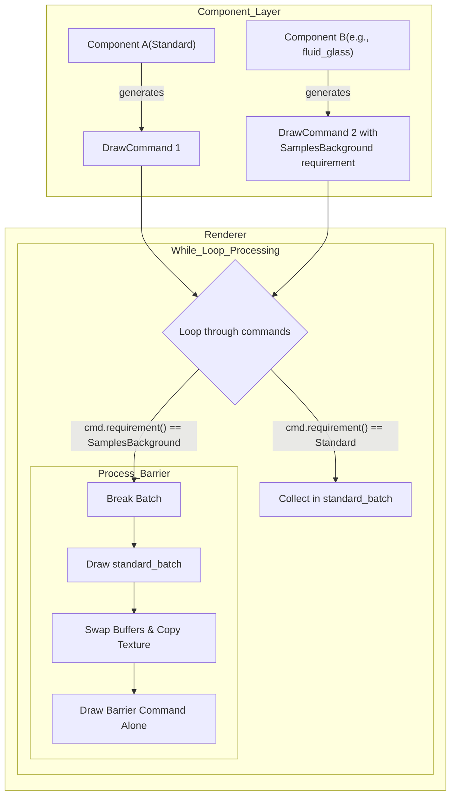
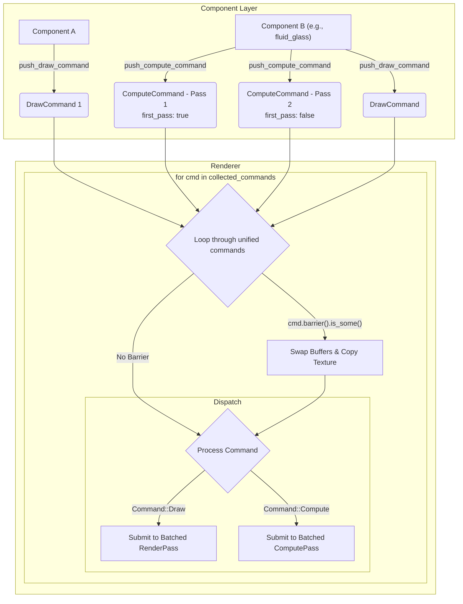

不久前，我为我的个人 UI 库项目 [Tessera](https://github.com/shadow3aaa/tessera) 完成了一次核心渲染器的重构。这次重构旨在<!--more-->解决一个长期存在的痛点：如何原生、高效地支持需要多通道（Multi-Pass）渲染的复杂视觉效果。为此，我提出了一种与传统渲染图（Render Graph）不同的 GPU Pass 组织与管理方法。

## 缘起：旧架构的瓶颈

在重构之前，Tessera 的渲染架构依赖于一个简单的模型：每个组件（`ComponentNode`）最多只能关联一个可绘制对象（`basic_drawable`），它由一个 `Box<dyn DrawCommand>` trait object 表示，负责向渲染器提交具体的绘制指令。

这种设计对于单次绘制（Single-Pass）的简单组件（如矩形、文本）来说清晰有效。然而，当面对需要多个渲染步骤的复杂效果，例如毛玻璃（`fluid_glass`），其局限性便暴露无遗。

毛玻璃效果通常需要至少三个 Pass：

1. **水平模糊 (Compute Pass)**：对背景纹理进行一次横向高斯模糊。
2. **垂直模糊 (Compute Pass)**：对水平模糊的结果再进行一次纵向高斯模糊。
3. **最终绘制 (Draw Pass)**：将两次模糊后的纹理绘制到屏幕上，并混合颜色、噪点等效果。

在旧架构下，一个组件只能提交一个 `DrawCommand`，无法直接表达这种多 Pass 的依赖关系。为了绕过这个限制，我引入了一个名为 `RenderRequirement` 的枚举。

```rust
// 旧设计
pub enum RenderRequirement {
    Standard,
    SamplesBackground,
}

pub trait DrawCommand {
    fn requirement(&self) -> RenderRequirement;
    // ...
}
```

当一个 `DrawCommand` 返回 `SamplesBackground` 时，渲染器会将其视为一个“屏障”（Barrier）。在执行这个指令前，渲染器会完成之前所有 `Standard` 指令的绘制，并将结果复制到一个临时纹理中，供“屏障”指令采样。

这种方法虽然勉强实现了多 Pass，但存在几个严重问题：

- **逻辑耦合**：组件的渲染逻辑被迫分散。例如，`fluid_glass` 的模糊计算被硬编码在 `DrawablePipeline` 的 `draw` 方法中，通过 `ComputePipelineRegistry` 同步调用，而不是由组件自身清晰地声明。这严重违反了单一职责原则。
- **扩展性差**：`RenderRequirement` 只有两种状态，无法表达更复杂的依赖关系（例如，一个 Pass 依赖前两个 Pass 的结果）。
- **设计僵化**：一个组件要么是 `Standard`，要么是 `SamplesBackground`，无法灵活地组合多个不同需求的渲染通道。

下图简要描述了旧架构的渲染流程：



## 破局：统一命令系统 (Unified Command System)

为了从根本上解决这些问题，我设计并实现了一套新的“统一命令系统”。其核心思想是：**将渲染过程看作是一系列命令（Command）的线性序列，而不仅仅是绘制指令的集合。**

### 1. `Command` 枚举：统一 Draw 与 Compute

新系统的核心是一个 `Command` 枚举，它将绘制（Draw）和计算（Compute）两种操作统一起来：

```rust
// 新设计
pub enum Command {
    Draw(Box<dyn DrawCommand>),
    Compute(Box<dyn ComputeCommand>),
}
```

`DrawCommand` 和 `ComputeCommand` 两个 trait 分别代表图形和计算操作。重要的是，它们都提供了一个 `barrier()` 方法来声明自身对前序 Pass 的依赖：

```rust
pub enum BarrierRequirement {
    SampleBackground,
}

pub trait DrawCommand {
    fn barrier(&self) -> Option<BarrierRequirement> {
        None // 默认无屏障
    }
}

pub trait ComputeCommand {
    fn barrier(&self) -> Option<BarrierRequirement> {
        None // 默认无屏障
    }
}
```

下图展示了新架构下更清晰、更线性的流程：



如果一个命令返回 `Some(BarrierRequirement::SampleBackground)`，渲染器就会在执行它之前插入一个屏障，确保它可以安全地采样之前所有命令的渲染结果。

### 2. 组件可以提交多个命令

`ComponentNodeMetaData` 的数据结构也发生了根本性变化。旧的单个绘制指令被一个命令向量取代：

```rust
// 旧设计
pub struct ComponentNodeMetaData {
    // ...
    pub basic_drawable: Option<Box<dyn DrawCommand>>,
}

// 新设计
pub struct ComponentNodeMetaData {
    // ...
    pub(crate) commands: Vec<Command>,
}
```

同时，我们为 `ComponentNodeMetaData` 提供了 `push_draw_command` 和 `push_compute_command` 两个辅助方法，让任何组件都能方便地向自己的命令队列中添加任意数量、任意类型的命令。

### 3. 渲染循环的演进

渲染器的主循环逻辑也随之进化。它不再是按 `RenderRequirement` 分成两类来处理，而是变成了一个线性的命令流处理器：

1. 从组件树中收集所有节点的 `Command` 列表，整合成一个大的命令队列。
2. 遍历这个队列中的每一个 `Command`。
3. **检查屏障**：在执行命令前，检查其 `barrier()` 方法。如果需要屏障，则交换读写缓冲区（Ping-pong Buffers），并将当前读取缓冲区的内容复制到写入缓冲区，为接下来的采样做准备。
4. **分发命令**：
    - 如果是 `Command::Draw`，则在一个 `RenderPass` 中执行。为了优化性能，渲染器会尽可能地将连续的、无屏障的 `DrawCommand` 合并到同一个 `RenderPass` 中执行。
    - 如果是 `Command::Compute`，则在一个 `ComputePass` 中执行，同样会合并连续的计算指令。

这个新流程清晰、线性且强大，它将 Pass 之间的依赖管理完全自动化了。

## 重构带来的收益

以 `fluid_glass` 组件为例，现在它的实现变得无比清晰和内聚：

```rust
// fluid_glass 组件的实现（简化后）
pub fn fluid_glass(args: FluidGlassArgs) {
    // ...
    if let Some(mut metadata) = input.metadatas.get_mut(&input.current_node_id) {
        // 1. 推入一个水平模糊的 ComputeCommand
        metadata.push_compute_command(BlurCommand {
            radius: args.blur_radius,
            direction: (1.0, 0.0),
            first_pass: true, // `first_pass` 会触发一个屏障
        });

        // 2. 推入一个垂直模糊的 ComputeCommand
        metadata.push_compute_command(BlurCommand {
            radius: args.blur_radius,
            direction: (0.0, 1.0),
            first_pass: false, // 第二个pass不需要屏障
        });

        // 3. 推入最终绘制的 DrawCommand
        metadata.push_draw_command(FluidGlassCommand { args });
    }
    // ...
}
```

## 与传统渲染图 (Render Graph) 的对比

看到这里，熟悉现代渲染架构的读者可能会问：这套系统和传统的渲染图（Render Graph）有什么区别？为什么不直接实现一个渲染图呢？

这是一个很好的问题。渲染图是一种强大的技术，它通过将渲染过程抽象成一个有向无环图（DAG），其中节点是渲染通道（Pass），边是资源依赖关系，从而实现自动化的屏障管理、内存优化和并行调度。像 Bevy 这样的游戏引擎就出色地运用了渲染图。

尽管渲染图功能强大，但我最终选择了更轻量、更线性的统一命令系统。这主要基于 Tessera 作为一个 UI 库的特定场景和设计哲学：

1. **心智模型的简单性**：对于 UI 组件的开发者来说，最直观的思考方式是“先做什么，后做什么”。我的命令系统完美地映射了这种线性的、命令式的思维。开发者只需按顺序 `push` 命令，就能精确控制渲染流程。而渲染图则要求开发者将思维切换到声明式的图节点和资源依赖，这引入了额外的认知开销，对于 UI 场景来说可能是一种不必要的复杂化。

2. **UI 渲染的线性特质**：一个复杂的游戏场景可能拥有庞大且动态变化的渲染图，需要复杂的调度优化。相比之下，UI 的渲染流程通常是相对固定的、线性的“堆叠”模式（A 在 B 之上，B 在 C 之上）。即使是多 Pass 的毛玻璃效果，其依赖关系也是一条直线。一个轻量级的线性命令队列足以高效地处理这种情况，而引入完整的图结构颇有“杀鸡用牛刀”之嫌。

3. **避免过度工程化**：一个功能完备的渲染图需要实现图的构建、编译、资源生命周期管理、内存混叠等复杂功能。对于 Tessera 目前的阶段和需求，这是一个巨大的工程负担。我的命令系统以最小的复杂性，精准地解决了多 Pass 依赖管理这个核心痛点，实现了“刚刚好”的设计。

总而言之，我的统一命令系统可以看作是一种“**特化且简化的渲染图**”。它借鉴了渲染图自动管理屏障的核心思想，但将其适配到了 UI 渲染的线性、命令式场景中，从而在解决问题的同时，保持了架构的轻量和开发者心智模型的简单。
所有与 `fluid_glass` 相关的渲染步骤都被封装在了它自己的定义之内。它首先提交两个计算命令来准备模糊纹理，然后提交一个绘制命令来完成最终渲染。每个命令都通过 `barrier()` 方法精确地声明了自己的依赖，渲染器则负责完美地执行这个序列。

这次重构带来的好处是显而易见的：

- **高度内聚**：组件的渲染逻辑完全自包含，不再泄露到 Pipeline 或渲染器中。
- **极致灵活**：任何组件都可以按需组合任意数量的 Draw 和 Compute Pass，为实现复杂的、富有创造力的视觉效果铺平了道路。
- **简化心智模型**：开发者不再需要关心 `RenderRequirement` 或手动管理 Pass 之间的依赖。他们只需按顺序提交命令，剩下的交给渲染器即可。

## 结论

通过引入统一命令系统，Tessera 的渲染后端完成了一次重要的演进。它从一个相对简单的单 Pass 模型，发展为一个强大、灵活且能自动管理复杂依赖的多 Pass 渲染引擎。这不仅解决了旧架构的根本性缺陷，也为 Tessera 未来的发展——无论是实现更惊艳的内置组件，还是赋能用户创造自定义的视觉效果——打下了坚实的基础。

这次重构再次印证了一个观点：一个良好、可扩展的底层架构，是上层功能创新和表达能力不断突破的关键。
