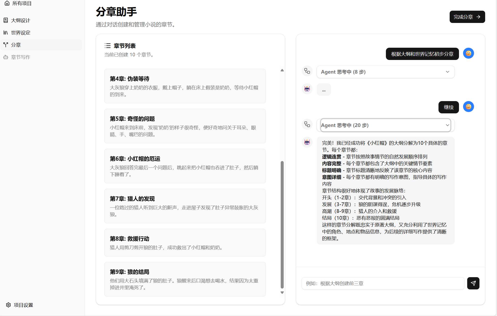


与 Blog 同步开发的开源项目: [PlotWeave](https://github.com/shadow3aaa/PlotWeave)


本文的内容是完成[小说 Agent 计划(四)-第三阶段：分章 (Chaptering)](../小说agent计划四#第三阶段分章-chaptering)的具体实现。

<!--more-->

## 前端初始化

先加入从创建世界记忆的界面跳转到分章的交互逻辑和分章的骨架页面。

### 跳转逻辑

在 `WorldSetupPage.tsx` 中加入和之前一样的跳转逻辑

```tsx
<div className="flex justify-between items-center">
  <div>
    <h1 className="text-3xl font-bold">世界设定助手</h1>
    <p className="mt-2 text-muted-foreground">
      通过对话来构建和查询你的世界记忆。当前项目 ID: {projectId}
    </p>
  </div>
  {project?.phase === ProjectPhase.WORLD_SETUP && (
    <Button onClick={handleAdvancePhase}>
      <span>完成世界记忆创建</span>
      <ArrowRight className="h-4 w-4" />
    </Button>
  )}
</div>
```

### 分章骨架页面

简单的占位一下

```tsx
function ChapteringPage() {
  return (
    <div>
      <h1 className="text-3xl font-bold">分章</h1>
      <p className="mt-2 text-muted-foreground">
        这里是分章页面，功能正在开发中。
      </p>
    </div>
  );
}

export default ChapteringPage;
```

### 锁定世界初始化页面

就像之前提到的，进入下一阶段之后再进行之前的阶段是不可接受的，所以我们需要锁定世界初始化页面

```tsx
<CardFooter className="p-4 border-t">
  <form onSubmit={handleSubmit} className="flex w-full items-center space-x-2">
    <Input
      value={input}
      placeholder={
        isReadOnly ? "已进入下一阶段，无法编辑" : "例如：他后来怎么样了？"
      }
      onChange={(e) => setInput(e.target.value)}
      disabled={isLoading || isReadOnly}
      autoComplete="off"
    />
    <Button
      type="submit"
      disabled={isLoading || isReadOnly}
      size="icon"
      className="flex-shrink-0"
    >
      <Send className="size-4" />
      <span className="sr-only">发送</span>
    </Button>
  </form>
</CardFooter>
```

## 设计并实现

在[小说 Agent 计划(四)-第三阶段：分章 (Chaptering)](../小说agent计划四#第三阶段分章-chaptering)中我是这样设计的：

> 分章的过程相对简单，主要是根据大纲将故事分成多个章节，并确定每章的主要内容。
>
> 我认为可以保持类似第二阶段的交互式设计，用户可以和 llm 对话，逐步完善章节分配。同时也可视化地展示章节列表，方便用户查看和编辑。

所以实现上需要通用化第二阶段的 agent 实现，使用不同的工具集和 prompt 即可。

### 通用化 agent.py

其实在第二阶段的实现中，agent 的代码已经比较通用化了，只需要把工具集提取出来即可。

```python
def build_graph(
    tools: list[BaseTool],
):
    """
    构建并返回特定的图对象
    """
    graph_builder = StateGraph(State)

    llm_with_tools = llm.bind_tools(tools)  # pyright: ignore[reportUnknownMemberType]
    def chatbot(state: State):
        return {"messages": [llm_with_tools.invoke(state["messages"])]}
    graph_builder.add_node("chatbot", chatbot)  # pyright: ignore[reportUnknownMemberType]
    graph_builder.add_edge(START, "chatbot")
    tool_node = ToolNode(tools=tools)
    graph_builder.add_node("tools", tool_node)  # pyright: ignore[reportUnknownMemberType]
    graph_builder.add_edge("tools", "chatbot")
    graph_builder.add_conditional_edges(
        "chatbot",
        route_tools,
        # The following dictionary lets you tell the graph to interpret the condition's outputs as a specific node
        # It defaults to the identity function, but if you
        # want to use a node named something else apart from "tools",
        # You can update the value of the dictionary to something else
        # e.g., "tools": "my_tools"
        {"tools": "tools", END: END},
    )
    return graph_builder.compile()  # pyright: ignore[reportUnknownMemberType]

world_setup_graph = build_graph(
    tools=world_tools.full_tools
)
```

### 新的工具集

接下来要确定分章阶段的工具集有哪些，我认为需要

- 查询世界记忆图谱的工具，从 `world_tools` 裁剪即可
- 读取大纲的工具
- 列出章节的工具
- 创建章节的工具
- 删除章节的工具

新建 `chapter_tools.py` 实现这些工具

```python
# 具体的实现过长，这里省略

full_tools: list[BaseTool] = [
    get_outline_tool,
    get_chapter_infos_tool,
    get_chapter_info_tool,
    delete_chapter_by_title_tool,
    delete_chapter_by_index_tool,
    add_chapter_tool_to_end_tool,
    add_chapter_tool_after_tool,
    add_chapter_tool_before_tool,
    replace_chapter_intent_tool,
    replace_chapter_title_tool,
]
```

在 `agent.py` 中定义响应的 `chaptering_graph`

```python
chaptering_graph = build_graph(
    tools=world_tools.read_only_tools + chapter_tools.full_tools
)
```

### 前端实现

前端的实现和第二阶段类似，主要是把 `WorldSetupPage.tsx` 复制一份，改成 `ChapteringPage.tsx`，然后把相关的 API 调用改成分章相关的。

这里同时也实现了章节可视化

```tsx
import {
  useState,
  useRef,
  type FormEvent,
  useEffect,
  useMemo,
  useCallback,
} from "react";
import { useParams, useNavigate } from "react-router-dom";
import ReactMarkdown from "react-markdown";
import {
  Send,
  ClipboardCopy,
  Check,
  Workflow,
  ArrowRight,
  BookPlus,
  List,
} from "lucide-react";

import { Button } from "@/components/ui/button";
import {
  Card,
  CardContent,
  CardFooter,
  CardHeader,
  CardTitle,
  CardDescription,
} from "@/components/ui/card";
import { Input } from "@/components/ui/input";
import { ScrollArea } from "@/components/ui/scroll-area";
import {
  Accordion,
  AccordionContent,
  AccordionItem,
  AccordionTrigger,
} from "@/components/ui/accordion";
import { cn } from "@/lib/utils";
import { type ProjectMetadata, ProjectPhase } from "@/components/ProjectCard";

// --- 对话消息的类型定义 ---
interface Message {
  id: string;
  role: "user" | "assistant";
  content: string;
  type?: "thinking" | "tool_result" | "final";
}

type GroupedMessage =
  | Message
  | { type: "tool_group"; messages: Message[]; id: string };

// --- 章节数据类型定义 ---
interface Chapter {
  title: string;
  intent: string;
}

// --- 辅助函数和组件 ---

/**
 * 解析流式响应的异步生成器函数。
 * @param stream - 从 fetch API 获取的可读流。
 */
async function* streamAsyncIterator(stream: ReadableStream<Uint8Array>) {
  const reader = stream.getReader();
  const decoder = new TextDecoder();
  let buffer = "";
  try {
    while (true) {
      const { done, value } = await reader.read();
      if (done) break;
      buffer += decoder.decode(value, { stream: true });
      const parts = buffer.split("\n\n");
      buffer = parts.pop() || "";
      for (const part of parts) {
        if (part.startsWith("data: ")) {
          yield part.substring(6);
        }
      }
    }
  } finally {
    reader.releaseLock();
  }
}

/**
 * 用于实现“复制到剪贴板”功能的 Hook。
 */
const useCopyToClipboard = () => {
  const [isCopied, setIsCopied] = useState(false);
  const copy = (text: string) => {
    navigator.clipboard.writeText(text);
    setIsCopied(true);
    setTimeout(() => setIsCopied(false), 2000); // 2秒后重置状态
  };
  return { isCopied, copy };
};

/**
 * 显示单条工具日志（Agent思考或工具结果）的组件。
 */
const ToolLogEntry = ({ message }: { message: Message }) => {
  const { isCopied, copy } = useCopyToClipboard();
  const title = message.type === "thinking" ? "Agent 思考" : "工具结果";

  return (
    <div className="relative group/log">
      <p className="text-xs font-semibold text-muted-foreground mb-1">
        {title}
      </p>
      <pre className="text-xs whitespace-pre-wrap font-mono bg-muted p-3 rounded-md">
        <code>{message.content}</code>
      </pre>
      <Button
        variant="ghost"
        size="icon"
        className="absolute top-0 right-0 h-6 w-6 opacity-0 group-hover/log:opacity-100 transition-opacity"
        onClick={() => copy(message.content)}
      >
        {isCopied ? (
          <Check className="size-3 text-green-500" />
        ) : (
          <ClipboardCopy className="size-3" />
        )}
      </Button>
    </div>
  );
};

/**
 * 将多条连续的工具日志组合成一个可折叠区域的组件。
 */
const ToolGroupMessage = ({ messages }: { messages: Message[] }) => {
  return (
    <div className="flex items-start gap-3">
      <div className="bg-muted rounded-full size-8 flex-shrink-0 flex items-center justify-center">
        <Workflow className="size-5 text-muted-foreground" />
      </div>
      <div className="w-full max-w-[80%]">
        <Accordion type="single" collapsible className="w-full">
          <AccordionItem
            value="item-1"
            className="border rounded-lg bg-background shadow-sm px-3"
          >
            <AccordionTrigger className="py-2 text-sm text-muted-foreground hover:no-underline font-semibold">
              Agent 思考中 ({messages.length} 步)
            </AccordionTrigger>
            <AccordionContent className="border-t pt-3 space-y-3">
              {messages.map((msg) => (
                <ToolLogEntry key={msg.id} message={msg} />
              ))}
            </AccordionContent>
          </AccordionItem>
        </Accordion>
      </div>
    </div>
  );
};

// --- 主页面组件 ---

function ChapteringPage() {
  const { projectId } = useParams<{ projectId: string }>();
  const navigate = useNavigate();

  const [messages, setMessages] = useState<Message[]>([]);
  const [chapters, setChapters] = useState<Chapter[]>([]);
  const [input, setInput] = useState("");
  const [isLoading, setIsLoading] = useState(false);
  const messagesEndRef = useRef<HTMLDivElement>(null);
  const [project, setProject] = useState<ProjectMetadata | null>(null);
  const [error, setError] = useState<string | null>(null);

  const fetchProjectData = useCallback(async () => {
    if (!projectId) return;
    try {
      const response = await fetch(`/api/projects/${projectId}`);
      if (!response.ok)
        throw new Error(`获取项目信息失败: ${response.statusText}`);
      const projectData: ProjectMetadata = await response.json();
      setProject(projectData);
    } catch (e) {
      if (e instanceof Error) setError(e.message);
    }
  }, [projectId]);

  const fetchChapters = useCallback(async () => {
    if (!projectId) return;
    try {
      const response = await fetch(`/api/projects/${projectId}/chapters`);
      if (!response.ok)
        throw new Error(`获取章节列表失败: ${response.statusText}`);
      const data = await response.json();
      setChapters(data.chapters);
    } catch (e) {
      if (e instanceof Error) console.error(e.message);
    }
  }, [projectId]);

  useEffect(() => {
    fetchProjectData();
    fetchChapters();
  }, [fetchProjectData, fetchChapters]);

  useEffect(() => {
    messagesEndRef.current?.scrollIntoView({ behavior: "smooth" });
  }, [messages]);

  const groupedMessages = useMemo(() => {
    const groups: GroupedMessage[] = [];
    let currentToolGroup: Message[] = [];
    for (const message of messages) {
      const isToolMessage =
        message.type === "thinking" || message.type === "tool_result";
      if (isToolMessage) {
        currentToolGroup.push(message);
      } else {
        if (currentToolGroup.length > 0) {
          groups.push({
            type: "tool_group",
            messages: currentToolGroup,
            id: `group-${currentToolGroup[0].id}`,
          });
          currentToolGroup = [];
        }
        groups.push(message);
      }
    }
    if (currentToolGroup.length > 0) {
      groups.push({
        type: "tool_group",
        messages: currentToolGroup,
        id: `group-${currentToolGroup[0].id}`,
      });
    }
    return groups;
  }, [messages]);

  const handleSubmit = async (e: FormEvent) => {
    e.preventDefault();
    if (!input.trim() || isLoading || !projectId) return;
    setIsLoading(true);
    const currentUserMessage = input;
    const historyBeforeSubmit = messages;
    const userMessage: Message = {
      id: `user-${Date.now()}`,
      role: "user",
      content: currentUserMessage,
    };
    const assistantPlaceholder: Message = {
      id: `assistant-${Date.now()}`,
      role: "assistant",
      content: "",
      type: "final",
    };
    setMessages((prev) => [...prev, userMessage, assistantPlaceholder]);
    setInput("");

    try {
      const response = await fetch(`/api/projects/${projectId}/chat/stream`, {
        method: "POST",
        headers: { "Content-Type": "application/json" },
        body: JSON.stringify({
          message: currentUserMessage,
          history: historyBeforeSubmit,
        }),
      });
      if (!response.ok || !response.body)
        throw new Error(`请求失败: ${response.statusText}`);
      for await (const chunk of streamAsyncIterator(response.body)) {
        if (chunk) {
          try {
            const parsedData = JSON.parse(chunk);
            const assistantMessageId = assistantPlaceholder.id;
            switch (parsedData.type) {
              case "thinking":
              case "tool_result":
                setMessages((prev) => {
                  const last = prev[prev.length - 1];
                  const rest = prev.slice(0, -1);
                  const newLog: Message = {
                    id: `log-${Date.now()}-${Math.random()}`,
                    role: "assistant",
                    content: parsedData.data,
                    type: parsedData.type,
                  };
                  return [...rest, newLog, last];
                });
                if (parsedData.type === "tool_result") {
                  fetchChapters();
                }
                break;
              case "token":
                setMessages((prev) =>
                  prev.map((msg) =>
                    msg.id === assistantMessageId
                      ? { ...msg, content: msg.content + parsedData.data }
                      : msg
                  )
                );
                break;
              case "end":
              case "error":
                break;
            }
          } catch (error) {
            console.error("解析SSE数据块失败:", chunk, error);
          }
        }
      }
    } catch (error) {
      console.error("流式请求失败:", error);
    } finally {
      setIsLoading(false);
      fetchChapters();
    }
  };

  const handleAdvancePhase = async () => {
    if (!projectId || !project) return;
    try {
      const response = await fetch(`/api/projects/${projectId}`, {
        method: "PUT",
        headers: { "Content-Type": "application/json" },
        body: JSON.stringify({
          ...project,
          phase: ProjectPhase.CHAPER_WRITING,
        }),
      });
      if (!response.ok) throw new Error("推进项目阶段失败");
      navigate(`/projects/${projectId}/chapter-writing`);
      window.location.reload();
    } catch (err) {
      if (err instanceof Error) setError(err.message);
    }
  };

  if (error) return <div className="p-8 text-red-500">错误: {error}</div>;
  const isReadOnly = project?.phase !== ProjectPhase.CHAPERING;

  return (
    <div className="flex flex-col h-full gap-4">
      <div className="flex justify-between items-center">
        <div>
          <h1 className="text-3xl font-bold">分章助手</h1>
          <p className="mt-2 text-muted-foreground">
            {isReadOnly ? "（只读模式）" : "通过对话创建和管理小说的章节。"}
          </p>
        </div>
        {project?.phase === ProjectPhase.CHAPERING && (
          <Button onClick={handleAdvancePhase}>
            <span>完成分章</span>
            <ArrowRight className="h-4 w-4" />
          </Button>
        )}
      </div>

      <div className="grid grid-cols-1 lg:grid-cols-2 gap-8 flex-1 min-h-0">
        {/* 左侧栏：章节列表 */}
        <Card className="flex flex-col min-h-0">
          {" "}
          <CardHeader>
            <CardTitle className="flex items-center gap-2">
              <List className="size-5" />
              <span>章节列表</span>
            </CardTitle>
            <CardDescription>
              当前已创建 {chapters.length} 个章节。
            </CardDescription>
          </CardHeader>
          <CardContent className="flex-1 overflow-y-auto">
            {" "}
            {chapters.length > 0 ? (
              <div className="space-y-4 pr-4">
                {chapters.map((chap, index) => (
                  <div
                    key={index}
                    className="border p-4 rounded-md bg-muted/50"
                  >
                    <h3 className="font-semibold">
                      第{index}章: {chap.title}
                    </h3>
                    <p className="text-sm text-muted-foreground mt-1">
                      {chap.intent}
                    </p>
                  </div>
                ))}
              </div>
            ) : (
              <div className="text-center text-muted-foreground py-10 flex flex-col items-center justify-center h-full">
                <BookPlus className="size-10 mb-2" />
                <p>还没有章节。</p>
                <p className="text-sm">请在右侧与助手对话来创建章节。</p>
              </div>
            )}
          </CardContent>
        </Card>

        {/* 右侧栏：聊天界面 (结构保持不变) */}
        <Card className="flex-1 grid grid-rows-[1fr,auto] min-h-0">
          <CardContent className="overflow-hidden p-4">
            <ScrollArea className="h-full pr-4">
              <div className="space-y-4">
                {groupedMessages.map((item) => {
                  if (item.type === "tool_group") {
                    return (
                      <ToolGroupMessage
                        key={item.id}
                        messages={item.messages}
                      />
                    );
                  }
                  const m = item;
                  return (
                    <div
                      key={m.id}
                      className={cn(
                        "flex items-start gap-3",
                        m.role === "user" ? "justify-end" : ""
                      )}
                    >
                      {m.role === "assistant" && (
                        <div className="bg-muted rounded-full size-8 flex-shrink-0 flex items-center justify-center">
                          🤖
                        </div>
                      )}
                      <div
                        className={cn(
                          "rounded-lg px-4 py-2 max-w-[80%]",
                          m.role === "user"
                            ? "bg-primary text-primary-foreground"
                            : "bg-muted"
                        )}
                      >
                        <div className="prose dark:prose-invert text-sm max-w-none">
                          <ReactMarkdown>{m.content || "..."}</ReactMarkdown>
                        </div>
                      </div>
                      {m.role === "user" && (
                        <div className="bg-blue-500 text-white rounded-full size-8 flex-shrink-0 flex items-center justify-center">
                          🙂
                        </div>
                      )}
                    </div>
                  );
                })}
                <div ref={messagesEndRef} />
              </div>
            </ScrollArea>
          </CardContent>
          <CardFooter className="p-4 border-t">
            <form
              onSubmit={handleSubmit}
              className="flex w-full items-center space-x-2"
            >
              <Input
                value={input}
                placeholder={
                  isReadOnly
                    ? "已进入下一阶段，无法编辑"
                    : "例如：根据大纲创建前三章"
                }
                onChange={(e) => setInput(e.target.value)}
                disabled={isLoading || isReadOnly}
                autoComplete="off"
              />
              <Button
                type="submit"
                disabled={isLoading || isReadOnly}
                size="icon"
                className="flex-shrink-0"
              >
                <Send className="size-4" />
                <span className="sr-only">发送</span>
              </Button>
            </form>
          </CardFooter>
        </Card>
      </div>
    </div>
  );
}

export default ChapteringPage;
```

至此，小说 Agent 计划的第三阶段：分章 (Chaptering) 的实现就完成了。


