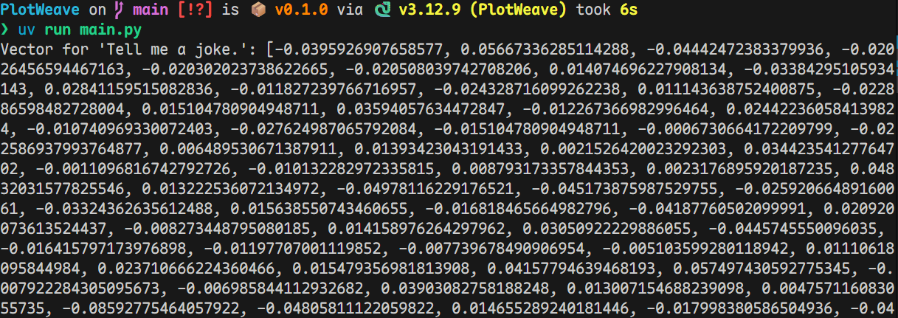
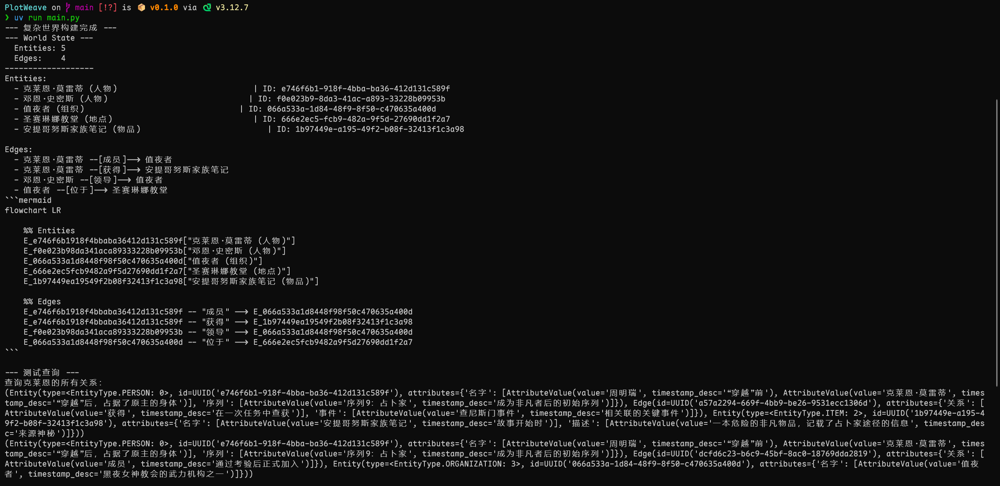
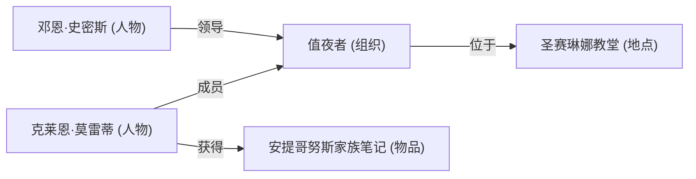

在[小说 Agent 计划(二)-实现关系图](../小说Agent计划二)中我们设计并实现了关系图模型。接下来我们要为它设计并实现一个向量检索的方法。这样对监督者和创作者 llm 来说关系图才真正可用。

<!--more-->

## 设计

### 检索

首先，需要检索的原因是小说 llm 需要获取到世界记忆的信息以进行合理的修改，而且它不直接知道它要访问的实体和边的 id，只能先通过描述去检索，再获取 id。

这里使用向量搜索的优势显而易见，对小说创作来说，一种物品可能有多种描述方式，甚至同一种物品在不同时间点的描述也会不同。

依然以《诡秘之主》为例，假设我们要检索主角克莱恩·莫雷蒂拥有的武器，假设其目前的实体如下

```python
Entity(
    type=EntityType.PERSON,
    attributes={
        "名字": [AttributeValue(value="克莱恩", timestamp_desc="故事开始时")],
        "性别": [AttributeValue(value="男", timestamp_desc="故事开始时")],
        "武器": [
            AttributeValue(
                value="“丧钟”手枪：含有“猎人”途径序列5“收割者”非凡特性。",
                timestamp_desc="经安德森介绍，克莱恩花费9000镑，从安德森过去团队的医师奥克法·康纳克里斯手中买到了“丧钟”。",
            ),
        ],
    },
)
```

此时，假设需要检索克莱恩·莫雷蒂的武器，假设检索的描述是“克莱恩常用于攻击的神奇物品”。如果使用的只是简单的模糊匹配，那么很可能无法匹配到“丧钟”手枪这个描述。但是使用向量搜索就可以很好的解决这个问题，显然“攻击”与“手枪”在向量空间中是比较接近的。

当然，这里其实“克莱恩”本身就能匹配到这个实体，这只不过是一个简单的例子，实际情况会复杂得多。

### 实现

首先我需要选择一个 python 的向量搜索库。

#### 选型

目前比较流行的向量搜索库有以下几种

- FAISS: Facebook AI Research 开发的一个高效的相似性搜索和聚类库，支持大规模数据集
- Annoy (Approximate Nearest Neighbors Oh Yeah): 基于随机投影树，适合内存内的快速近似最近邻搜索
- HNSWlib: 基于分层导航小世界图(Hierarchical Navigable Small World)的高效近似最近邻搜索库
- Milvus: 一个开源的向量数据库，支持大规模向量数据的存储和检索
- Qdrant: 用 Rust 编写的开源向量数据库，支持过滤、分布式部署、云原生架构

非常多选择，使我的选择困难症旋转。

先用排除法，`Annoy` 适合内存内的快速近似最近邻搜索，但是它的核心问题在于索引一旦构建完成就是只读的。与“只增不改”的动态数据模型完全冲突。每次添加新实体或事件都需要重新构建整个索引，效率极低，因此不适合此场景，排除。`Milvus` 过于重型，且需要额外的服务支持，排除。

那么我们有

- FAISS
- HNSWlib
- Qdrant

一个个分析

- FAISS: 老牌劲旅，性能优异，社区活跃，文档完善，反过来说也没有特别独特的地方
- HNSWlib: 性能优异，且支持动态添加和删除向量，适合动态数据场景，文档也比较完善，就是不支持元数据，还得自己维护
- Qdrant: 支持动态添加和删除向量，且支持元数据，适合动态数据场景，文档也比较完善，可用额外的服务，也可直接内置。**用 Rust 写的 👍👍👍👍👍**

显然直接选择 `Qdrant`。

```bash
uv add qdrant-client
```

#### 集成到关系图

似乎没有理由把它单独作为一个模块存在，毕竟它是关系图的一个重要组成部分，我选择把它集成到 `World` 类中。

首先加入一个向量化函数封装

```python
openai = AsyncOpenAI(
    base_url=config.vector_base_url,
    api_key=config.vector_api_key,
)

async def generate_vector(text: str) -> list[float] | None:
    response = await openai.embeddings.create(
        model=config.vector_model,
        input=[text],
    )
    return response.data[0].embedding
```

测试一下

```python
async def main():
    source = "Tell me a joke."
    vectored = await vector.generate_vector(source)
    print(f"Vector for '{source}': {vectored}")
```



看起来一切正常，接下来是集成到 `World` 类中。首先修改 `World` 的初始化，加入 `Qdrant` 客户端

```python
def __init__(self):
    self.graph: networkx.MultiDiGraph[UUID] = networkx.MultiDiGraph()
    self.client = QdrantClient(location=":memory:") # 暂时使用内存保存以测试
```

`Qdrant` 需要一个集合来存储向量，但是`__init__` 不支持是 async 的，所以我新建了一个`initialize` 方法来初始化异步资源

```python
async def initialize(self):
    """
    初始化一些异步资源，必须在创建之后尽早调用
    """
    await self.client.recreate_collection(
        collection_name="world",
        vectors_config={
            "vector": VectorParams(size=config.vector_dimension, distance=Distance.COSINE)
        },
    )
```

然后修改添加实体的方法，加入向量化和存储到 `Qdrant`。`Qdrant` 支持存储元数据，我们首先要明确什么是应该被向量化的，什么是应该被存储为元数据的。检索的目的是是检索内容，所以对实体来说属性应该被向量化，而 id 和 type 应该作为元数据存储。

```python
async def add_entity(self, entity: Entity):
    """
    添加实体

    如果实体已存在则抛出异常
    """
    if entity.id in self.graph:
        raise ValueError(f"Entity with id {entity.id} already exists.")
    self.graph.add_node(entity.id, entity=entity)
    entity_attributes_str = "\n".join(
        f"{key}：{', '.join(f"{av.value} ({av.timestamp_desc})" for av in values)}"
        for key, values in entity.attributes.items()
    )
    entity_str = f"""实体属性：
{entity_attributes_str}
"""
    entity_vector = await vector.generate_vector(entity_str)
    if entity_vector is None:
        raise ValueError("Failed to generate vector for entity.")
    attributes_payload = {
        key: [
            {"value": av.value, "timestamp_desc": av.timestamp_desc}
            for av in values
        ]
        for key, values in entity.attributes.items()
    }
    point = PointStruct(
        id=str(entity.id),
        vector=entity_vector,
        payload={
            "id": str(entity.id),
            "type": str(entity.type),
            "attributes": attributes_payload,
        },
    )
    await self.client.upsert(
        collection_name="world",
        points=[point],
    )
```

添加边的方法同理

```python
sync def add_edge(self, from_entity_id: UUID, to_entity_id: UUID, edge: Edge):
    """
    添加边

    如果边已存在，或者起点或终点实体不存在则抛出异常
    """
    if from_entity_id not in self.graph or to_entity_id not in self.graph:
        raise ValueError("Both entities must exist in the graph.")
    if edge.id in self.graph:
        raise ValueError(f"Edge with id {edge.id} already exists.")
    self.graph.add_edge(from_entity_id, to_entity_id, key=edge.id, edge=edge)
    edge_attributes_str = "\n".join(
        f"{key}：{', '.join(f"{av.value} ({av.timestamp_desc})" for av in values)}"
        for key, values in edge.attributes.items()
    )
    edge_str = f"""边属性：
{edge_attributes_str}
"""
    edge_vector = await vector.generate_vector(edge_str)
    if edge_vector is None:
        raise ValueError("Failed to generate vector for edge.")
    attributes_payload = {
        key: [
            {"value": av.value, "timestamp_desc": av.timestamp_desc}
            for av in values
        ]
        for key, values in edge.attributes.items()
    }

    point = PointStruct(
        id=str(edge.id),
        vector=edge_vector,
        payload={
            "id": str(edge.id),
            "type": "边",
            "from_entity_id": str(from_entity_id),
            "to_entity_id": str(to_entity_id),
            "attributes": attributes_payload,
        },
    )
    await self.client.upsert(
        collection_name="world",
        points=[point],
    )
```

至此，写入向量库的集成已经完成。现在该开始写查询方法了。

问题是，是否应该分开查询实体和查询边？目前我觉得没有必要，直接一个方法就行了。

首先需要定义查询的结果。查询需要什么结果？查询的目的是获取相关信息和相关实体或者边，因此需要

- 相关边/实体的 id
- 相关属性内容

光有 id 无法访问也不行，所以还需要加一个根据 id 获取实体/边的方法。

首先定义查询结果

```python
@dataclass
class SearchResultEntity:
    """
    搜索结果(实体)

    - id: 实体的唯一标识符
    - type: 实体类型
    - attributes: 属性信息
    - score: 相似度分数，数值越大表示越相似
    """

    id: str
    type: str
    attributes: dict[str, list[AttributeValue]]
    score: float

@dataclass
class SearchResultEdge:
    """
    搜索结果(边)

    - id: 边的唯一标识符
    - from_entity_id: 起点实体的唯一标识符
    - to_entity_id: 终点实体的唯一标识符
    - attributes: 属性信息
    - score: 相似度分数，数值越大表示越相似
    """

    id: str
    from_entity_id: str
    to_entity_id: str
    attributes: dict[str, list[AttributeValue]]
    score: float

SearchResult: TypeAlias = SearchResultEntity | SearchResultEdge
```

这里 id 由 uuid 变为了 str，因为`Qdrant`的 id 只能是字符串或者整数，反正 uuid 转字符串也是唯一的。

接下来就能实现查询方法了

```python
async def search(self, query: str, limit: int = 5) -> list[SearchResult]:
    """
    搜索与查询最相关的实体和边

    返回搜索结果列表，包含实体和边
    """
    query_vector = await vector.generate_vector(query)
    if query_vector is None:
        raise ValueError("Failed to generate vector for query.")
    search_result = await self.client.search(
        collection_name="world",
        limit=limit,
        query_vector=query_vector,
        with_payload=True,
    )
    # 解析搜索结果
    results: list[SearchResult] = []
    for point in search_result:
        payload = point.payload
        if payload is None:
            raise ValueError("Search result payload is None. Borken data?")
        if payload.get("type") == "边":
            result = SearchResultEdge(
                id=payload["id"],
                from_entity_id=payload["from_entity_id"],
                to_entity_id=payload["to_entity_id"],
                attributes={
                    key: [
                        AttributeValue(
                            value=av["value"], timestamp_desc=av["timestamp_desc"]
                        )
                        for av in values
                    ]
                    for key, values in payload.get("attributes", {}).items()
                },
                score=point.score,
            )
        else:
            result = SearchResultEntity(
                id=payload["id"],
                type=payload["type"],
                attributes={
                    key: [
                        AttributeValue(
                            value=av["value"], timestamp_desc=av["timestamp_desc"]
                        )
                        for av in values
                    ]
                    for key, values in payload.get("attributes", {}).items()
                },
                score=point.score,
            )
        results.append(result)
    return results
```

然后是根据 id 获取实体或者边的方法，这里提供这些

- 根据实体 id 获取实体
- 根据边 id 获取边
- 根据实体 id 获取相关边
- 根据两个实体 id 获取相关边

首先是直接根据 id 获取实体和边的方法，这两个相对直接而简单

```python
def get_entity(self, entity_id: UUID) -> Entity | None:
    """
    根据实体ID获取实体

    - entity_id: 实体的唯一标识符

    如果实体不存在则返回None
    """
    node_data = self.graph.nodes.get(entity_id)
    if node_data is None:
        return None
    return node_data.get("entity")

def get_edge(self, edge_id: UUID) -> Edge | None:
    """
    根据边ID获取边

    - edge_id: 边的唯一标识符

    如果边不存在则返回None
    """
    for _, _, key, edge_data in self.graph.edges(data=True, keys=True):
        if key == edge_id:
            return edge_data.get("edge")
    return None
```

然后是根据两个实体 id 获取相关边

```python
def get_related_edges(
        self, entity_id: UUID
    ) -> list[tuple[Entity, Edge, Entity]] | None:
    """
    获取与指定实体相关的所有边，并自动去重。

    包括以该实体为起点或终点的边。
    返回(开始实体, 边, 结束实体)列表。

    如果实体不存在则返回None。
    """
    if entity_id not in self.graph:
        return None

    # 使用 set 来自动处理重复的边（例如自环）
    found_edges: set[tuple[Entity, Edge, Entity]] = set()

    # 获取所有出边 (entity -> neighbor)
    for u, v, _, edge_data in self.graph.out_edges(entity_id, data=True, keys=True):
        edge = edge_data.get("edge")
        if edge:
            # 这里的 u, v 分别是起点和终点的 ID
            start_entity = self.get_entity(u)
            end_entity = self.get_entity(v)
            if start_entity and end_entity:
                found_edges.add((start_entity, edge, end_entity))

    # 获取所有入边 (predecessor -> entity)
    for u, v, _, edge_data in self.graph.in_edges(entity_id, data=True, keys=True):
        edge = edge_data.get("edge")
        if edge:
            start_entity = self.get_entity(u)
            end_entity = self.get_entity(v)
            if start_entity and end_entity:
                found_edges.add((start_entity, edge, end_entity))

    return list(found_edges)
```

最后是根据两个实体 id 获取相关边

```python
def get_edges_between(
    self, from_entity_id: UUID, to_entity_id: UUID
) -> list[Edge] | None:
    """
    获取两个实体之间的所有边

    - from_entity_id: 起点实体的唯一标识符
    - to_entity_id: 终点实体的唯一标识符

    如果任一实体不存在则返回None
    """
    if from_entity_id not in self.graph or to_entity_id not in self.graph:
        return None
    edges: list[Edge] = []
    edges_raw = self.graph.get_edge_data(from_entity_id, to_entity_id, default={})
    # 转回list[Edge]
    for edge_data in edges_raw.values():
        edge = edge_data.get("edge")
        if edge:
            edges.append(edge)
    return edges
```

### 测试

至此，关系图的向量检索功能已经完成。下面进行测试。

````python
async def main():
    world = World()
    await world.initialize()

    # 实体：克莱恩·莫雷蒂
    klein = Entity(
        type=EntityType.PERSON,
        attributes={
            "名字": [
                AttributeValue(value="周明瑞", timestamp_desc="“穿越”前"),
                AttributeValue(value="克莱恩·莫雷蒂", timestamp_desc="“穿越”后，占据了原主的身体"),
            ],
            "序列": [
                AttributeValue(value="序列9：占卜家", timestamp_desc="成为非凡者后的初始序列"),
            ],
        },
    )

    # 实体：邓恩·史密斯
    dunn_smith = Entity(
        type=EntityType.PERSON,
        attributes={
            "名字": [AttributeValue(value="邓恩·史密斯", timestamp_desc="故事开始时")],
            "职位": [AttributeValue(value="值夜者小队队长", timestamp_desc="廷根市值夜者负责人")],
            "特征": [AttributeValue(value="记性很差，发际线高", timestamp_desc="非凡特性带来的副作用")],
        },
    )

    # 实体：值夜者组织
    nighthawks = Entity(
        type=EntityType.ORGANIZATION,
        attributes={"名字": [AttributeValue(value="值夜者", timestamp_desc="黑夜女神教会的武力机构之一")]},
    )

    # 实体：圣赛琳娜教堂
    st_selena_cathedral = Entity(
        type=EntityType.PLACE,
        attributes={"名字": [AttributeValue(value="圣赛琳娜教堂", timestamp_desc="黑夜女神教会位于廷根市的教堂")]},
    )

    # 实体：安提哥努斯家族笔记
    antigonus_notebook = Entity(
        type=EntityType.ITEM,
        attributes={
            "名字": [AttributeValue(value="安提哥努斯家族笔记", timestamp_desc="故事开始时")],
            "描述": [AttributeValue(value="一本危险的非凡物品，记载了占卜家途径的信息", timestamp_desc="来源神秘")],
        }
    )

    # --- 2. 将实体添加到世界中 ---
    await world.add_entity(klein)
    await world.add_entity(dunn_smith)
    await world.add_entity(nighthawks)
    await world.add_entity(st_selena_cathedral)
    await world.add_entity(antigonus_notebook)


    # --- 3. 创建并添加实体间的关系（边） ---

    # 关系：克莱恩加入值夜者
    klein_joins_nighthawks = Edge(
        attributes={
            "关系": [AttributeValue(value="成员", timestamp_desc="通过考验后正式加入")],
        }
    )
    await world.add_edge(klein.id, nighthawks.id, klein_joins_nighthawks)

    # 关系：邓恩是值夜者的队长
    dunn_is_captain = Edge(
        attributes={
            "关系": [AttributeValue(value="领导", timestamp_desc="作为队长领导廷根市值夜者")],
        }
    )
    await world.add_edge(dunn_smith.id, nighthawks.id, dunn_is_captain)

    # 关系：值夜者位于教堂地下
    nighthawks_in_cathedral = Edge(
        attributes={
            "关系": [AttributeValue(value="位于", timestamp_desc="其总部位于教堂的地下区域，如查尼斯门后")],
        }
    )
    await world.add_edge(nighthawks.id, st_selena_cathedral.id, nighthawks_in_cathedral)

    # 关系：克莱恩获得安提哥努斯笔记
    klein_obtains_notebook = Edge(
        attributes={
            "关系": [AttributeValue(value="获得", timestamp_desc="在一次任务中查获")],
            "事件": [AttributeValue(value="查尼斯门事件", timestamp_desc="相关联的关键事件")],
        }
    )
    await world.add_edge(klein.id, antigonus_notebook.id, klein_obtains_notebook)


    # --- 4. 打印最终的世界状态 ---
    print("--- 复杂世界构建完成 ---")
    print(world)
    print("```mermaid")
    print(world.to_mermaid())
    print("```")

    # 测试查询
    print("\n--- 测试查询 ---")
    print("查询克莱恩的所有关系：")
    klein_edges = world.get_related_edges(klein.id)
    if klein_edges is not None:
        for edge in klein_edges:
            print(edge)
````

测试结果




