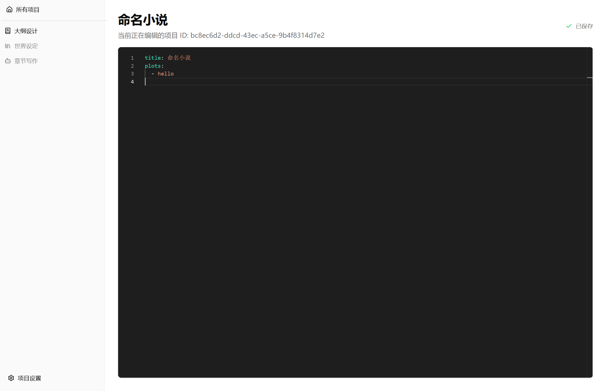

本文的内容是完成[小说 Agent 计划(四)-第一阶段: 大纲设计](../小说agent计划四#第一阶段大纲设计-outline-design)的具体实现。同时也会初始化可视化界面。

<!--more-->

## 开发

比较尴尬的是，`PlotWeave` 是一个 python 项目，并不好直接写前端。诚然，现在有很多专门用于 ai 应用的 Python Web 可视化库，比如 `Streamlit`、`Gradio` 等等，但是我们的需求有 `graph` 可视化、`yaml` 编辑器，大纲可视化等，用它们没法很好的实现。

### FASTAPI，启动

似乎我们必须将前后端分离，以用现代 web 技术自由发挥了。

想要做到这一点最方便的是 `FASTAPI`，它是一个现代、快速（高性能）的 Web 框架，这里我们用它来将我们的 `PlotWeave` python 部分作为后端 API 提供给可视化前端。

```bash
uv add fastapi "uvicorn[standard]"
```

我希望保留 `main.py` 继续用于测试，所以这个后端我决定新建一个`server.py`。

先些一个基本的 `FASTAPI` 服务器测试一下

```python
from fastapi import FastAPI

app = FastAPI()

@app.get("/")
def read_root():
    return {"message": "欢迎访问剧情织机 (PlotWeave) 后端"}
```

浏览器访问测试一下

```json
{ "message": "欢迎访问剧情织机 (PlotWeave) 后端" }
```

很好，服务器启动成功。

### 创建前端项目

接下来创建一个子项目用于编写前端页面，这里我选择的是`Vite` + `React` ，没有特殊的原因 **I USE YARN BTW**。

```bash
yarn create vite
```

这里我选择 `React` + `Typescript + SWC` 模板，项目名叫 `webui`。

### ui 库选型

还需要一个 ui 库方便大部分页面的搭建，我选择 `shadcn/ui` ，它是基于 `Radix UI` 和 `Tailwind CSS` 的组件库，组件丰富且易于定制。

这需要安装 `Tailwind CSS` 和 `shadcn/ui`，修改配置等，这里不赘述。

### 页面设计

接下来是页面设计了

#### 入口页面

我认为前端进入时需要先读取现有的小说项目并列出展示给用户选择，或者创建一个新的小说项目。

首先先解决后端持久化和加载这方面的问题，这代表我们要开始实现 `PlotWeave` 的持久化功能了。

首先先确定持久化方式，需要持久化的内容无非是下面几个

- 项目名
- 世界记忆
- 大纲
- 分章
- 小说实际文字内容

其中世界记忆使用的是 `networkx + qdrant`，`networkx` 可以用 `pickle` 保存，而 `qdrant` 本身就有持久化功能，只要给它提供路径即可。

所以持久化目录可设计为这样




















来做个实例封装方便持久化和管理

```python
class ProjectInstant:
    """
    持有一个小说项目的所有数据

    目前包括

    - 项目名
    - 世界记忆
    - 大纲
    - 分章
    - 小说实际文字内容

    可从文件系统加载和保存
    """
```

在实现 `__init__` 之前先设计实现字段的持久化，先从简单的开始，项目名就是 `str`，到时放入 `metadata.json` 中保存即可。然后是大纲，创建一个 `Outline` 数据类方便序列化和反序列化

```python
class Outline(BaseModel):
    """
    小说大纲

    包括以下内容

    - title: 小说标题
    - plots: 主要情节列表
    """

    title: str = "未命名小说"
    plots: list[str] = []


class OutlineLoadError(Exception):
    """加载大纲文件时发生错误的基类"""

    pass


class OutlineSaveError(Exception):
    """保存大纲文件时发生错误的基类"""

    pass


def load_from_file(path: str) -> Outline:
    """
    从指定路径加载并验证大纲。

    如果失败，则抛出 OutlineLoadError 异常。
    """
    try:
        with open(path, "r", encoding="utf-8") as f:
            data = yaml.safe_load(f)
            if not isinstance(data, dict):
                raise OutlineLoadError(f"文件 '{path}' 的内容不是有效的字典结构。")

            return Outline.model_validate(data)

    except FileNotFoundError as e:
        raise OutlineLoadError(f"找不到大纲文件 '{path}'。") from e
    except yaml.YAMLError as e:
        raise OutlineLoadError(f"大纲文件 '{path}' YAML 格式无效。") from e
    except ValidationError as e:
        raise OutlineLoadError(f"大纲文件 '{path}' 内容不符合规范。") from e


def save_to_file(outline: Outline, path: str):
    """
    将大纲保存到指定路径，覆盖已有文件。
    如果失败，则抛出 OutlineSaveError 异常。
    """
    try:
        data_to_save = outline.model_dump()
        with open(path, "w", encoding="utf-8") as f:
            # 如前述，使用 dump 是更常规的选择
            yaml.dump(data_to_save, f, allow_unicode=True, sort_keys=False)

    except IOError as e:
        # 捕获所有可能的IO错误 (如权限不足、路径不存在等)
        raise OutlineSaveError(f"无法将大纲写入文件 '{path}'。") from e
```

接着是分章，这里我们不需要单独表示，因为分章信息可以从 `outputs` 目录下的文件名中提取出来。小说实际文字同理。

最后是世界记忆，让我们先把之前那个测试用的 `:memory:` 换成按文件路径持久化。

```python
def __init__(self, persistent_path: str | None = None):
    """
    创建一个空白的世界记忆

    - persistent_path: 如果提供，则使用该路径的Qdrant数据库进行持久化存储。

    注意，在它的任何异步方法之前，必须先调用 initialize() 进行异步资源的初始化
    """
    self.graph: networkx.MultiDiGraph[UUID] = networkx.MultiDiGraph()
    if persistent_path is None:
        location = ":memory:"
    else:
        location = path.abspath(persistent_path)
    self.client = AsyncQdrantClient(location=location)
```

然后是元数据 `metadata.json` 对应的数据类

```python
class ProjectMetadata(BaseModel):
    """
    小说项目的元数据

    包括以下内容

    - name: 项目名称
    """

    name: str = "未命名项目"
```

接下来给 `ProjectInstant` 实现创建方法

```python
def __init__(self, name: str):
    """
    初始化一个小说项目

    注意这不是从文件系统加载已有的

    - name: 项目名，可与已有的重复
    """

    self.id = uuid4()
    self.name = name
    self.world = World(persistent_path=instant_directory(self.id))
    self.outline = Outline()
    self.metadata = ProjectMetadata(name=name)

async def initialize(self):
    """
    初始化异步资源

    必须在调用任何异步方法之前调用
    """
    await self.world.initialize()
```

然后实现一下从文件系统加载和保存的方法

```python
async def load_from_directory(dir: str) -> ProjectInstant:
    """
    从指定目录加载小说项目

    - dir: 小说项目的根目录
    """

    # 绕过__init__创建空白实例
    instant = ProjectInstant.__new__(ProjectInstant)
    instant.id = extract_id_from_directory(dir)
    instant.metadata = await project_metadata.load_from_file(metadata_path(instant.id))
    instant.world = World(persistent_path=qdrant_path(instant.id))
    instant.outline = await outline.load_from_file(outline_path(instant.id))
    return instant


async def save_to_directory(instant: ProjectInstant):
    """
    将小说项目保存到指定目录

    - instant: 小说项目实例

    不需要指定目录，它由实例的 UUID 自动决定
    """

    await project_metadata.save_to_file(instant.metadata, metadata_path(instant.id))
    await outline.save_to_file(instant.outline, outline_path(instant.id))
    await instant.world.sync_to_disk()
```

这样我们就完成了 `ProjectInstant` 的设计和实现。接下来在 `main.py` 测试一下。

首先是创建一个新的小说项目实例并保存

```python
async def main():
    instant = ProjectInstant("测试项目")
    await instant.initialize()
    await project_instant.save_to_directory(instant)
```

看看创建的对不对

```bash
tre datas -a
```

```text
datas
├── .gitkeep
└── 0c928ff9-b0e6-423f-971f-0dd7d2c9cc01
    ├── graph.pkl
    ├── metadata.json
    ├── outline.yaml
    └── qdrant
        ├── .lock
        ├── collection
        │   └── world
        │       └── storage.sqlite
        └── meta.json

Directories: 4, Files: 7, Symbolic Links: 0, Lines: 0
```

很好，目录结构正确。接下来测试加载

```python
async def main():
    instant = await project_instant.load_from_directory(
        dir="0c928ff9-b0e6-423f-971f-0dd7d2c9cc01"
    )
    await instant.initialize()
```

看起来也没问题。

回到前端初始化页面设计。先设计一下小说项目卡片

```tsx
import {
  Card,
  CardDescription,
  CardFooter,
  CardHeader,
  CardTitle,
} from "@/components/ui/card";
import { Button } from "@/components/ui/button";

export interface ProjectMetadata {
  id: string;
  name: string;
}

interface ProjectCardProps {
  project: ProjectMetadata;
}

export function ProjectCard({ project }: ProjectCardProps) {
  return (
    <Card className="flex flex-col">
      <CardHeader>
        <CardTitle>{project.name}</CardTitle>
        <CardDescription>ID: {project.id}</CardDescription>
      </CardHeader>
      <CardFooter className="flex justify-between items-center">
        <Button>进入项目</Button>
      </CardFooter>
    </Card>
  );
}
```

入口页面

```tsx
import { useState, useEffect } from "react";
import { ProjectCard, type ProjectMetadata } from "@/components/ProjectCard";
import { Button } from "./components/ui/button";

function App() {
  const [projects, setProjects] = useState<ProjectMetadata[]>([]);
  const [isLoading, setIsLoading] = useState(true);

  useEffect(() => {
    const fetchProjects = async () => {
      try {
        const response = await fetch("/api/projects");
        const data = await response.json();
        setProjects(data.projects);
      } catch (error) {
        console.error("获取项目列表失败:", error);
      } finally {
        setIsLoading(false);
      }
    };
    fetchProjects();
  }, []);

  if (isLoading) {
    return <div className="p-8">正在加载项目...</div>;
  }

  return (
    <div className="container mx-auto p-4 sm:p-8">
      <header className="mb-8">
        <h1 className="text-4xl font-bold">剧情织机</h1>
        <p className="text-muted-foreground">
          选择一个项目开始，或创建一个新项目。
        </p>
      </header>

      <main>
        {projects.length > 0 ? (
          <div className="grid grid-cols-1 gap-6 sm:grid-cols-2 lg:grid-cols-3">
            {projects.map((project) => (
              // 使用 map 循环渲染 ProjectCard
              <ProjectCard key={project.id} project={project} />
            ))}
          </div>
        ) : (
          <div className="text-center py-16">
            <p>还没有项目，快来创建你的第一个故事世界吧！</p>
            <Button className="mt-4">创建新项目</Button>
          </div>
        )}
      </main>
    </div>
  );
}

export default App;
```

这样我们就完成了入口页面的设计，接下来实现 `server.py` 的 `/api/projects` 接口。

```python
async def async_rglob(
    root: str | Path,
    pattern: str = "*",
) -> AsyncGenerator[Path, None]:
    """
    异步递归遍历目录，返回匹配到的文件路径。

    - root: 起始目录
    - pattern: 匹配模式，默认为 "*"（所有文件）
    """
    root = Path(root)

    loop = asyncio.get_running_loop()
    files = await loop.run_in_executor(None, lambda: list(root.rglob(pattern)))

    for file in files:
        yield file


@app.get("/api/projects", response_model=ProjectListResponse)
async def list_all_projects():
    """
    获取所有已创建小说项目的元数据列表
    """
    projects_list: list[ProjectMetadata] = []
    async for file in async_rglob(root="datas", pattern="metadata.json"):
        metadata = await project_metadata.load_from_file(str(file))
        projects_list.append(metadata)
    return ProjectListResponse(projects=projects_list)
```

在浏览器访问测试一下


很好，项目列表接口工作正常，前端页面也能正确显示。

接下来加入创建和删除新项目的接口和对应的前端更新。

```python
@app.post("/api/projects", response_model=ProjectMetadata)
async def create_project(request: CreateProjectRequest):
    """
    创建一个新的小说项目
    """
    instant = ProjectInstant(request.name)
    await instant.initialize()
    await project_instant.save_to_directory(instant)
    return instant.metadata


@app.delete("/api/projects/{project_id}", status_code=200)
async def delete_project(project_id: str):
    """
    删除指定的小说项目
    """
    project_dir = Path("datas") / str(project_id)  # 转换为 str

    if not project_dir.exists() or not project_dir.is_dir():
        raise HTTPException(status_code=404, detail="项目未找到")

    try:
        await asyncio.to_thread(shutil.rmtree, project_dir)
        return {"ok": True, "message": f"项目 {project_id} 已删除"}
    except Exception as e:
        raise HTTPException(status_code=500, detail=f"删除项目时发生错误: {e}")
```

前端部分

```tsx
import { useState, useEffect } from "react";
import { ProjectCard, type ProjectMetadata } from "@/components/ProjectCard";
import { Button } from "./components/ui/button";
import {
  Dialog,
  DialogContent,
  DialogDescription,
  DialogFooter,
  DialogHeader,
  DialogTitle,
  DialogTrigger,
} from "@/components/ui/dialog";
import { Input } from "@/components/ui/input";
import { Label } from "@/components/ui/label";

function App() {
  const [projects, setProjects] = useState<ProjectMetadata[]>([]);
  const [isLoading, setIsLoading] = useState(true);
  const [newProjectName, setNewProjectName] = useState("");
  const [isCreateDialogOpen, setIsCreateDialogOpen] = useState(false);

  const fetchProjects = async () => {
    try {
      const response = await fetch("/api/projects");
      const data = await response.json();
      setProjects(data.projects);
    } catch (error) {
      console.error("获取项目列表失败:", error);
    } finally {
      setIsLoading(false);
    }
  };

  useEffect(() => {
    fetchProjects();
  }, []);

  const handleCreateProject = async () => {
    if (!newProjectName.trim()) {
      alert("项目名称不能为空");
      return;
    }
    try {
      const response = await fetch("/api/projects", {
        method: "POST",
        headers: {
          "Content-Type": "application/json",
        },
        body: JSON.stringify({ name: newProjectName }),
      });
      const newProject: ProjectMetadata = await response.json();

      setProjects((currentProjects) => [newProject, ...currentProjects]);

      setNewProjectName("");
      setIsCreateDialogOpen(false);
    } catch (error) {
      console.error("创建项目失败:", error);
    }
  };

  const handleDeleteProject = async (projectId: string) => {
    try {
      await fetch(`/api/projects/${projectId}`, {
        method: "DELETE",
      });
      setProjects((currentProjects) =>
        currentProjects.filter((p) => p.id !== projectId)
      );
    } catch (error) {
      console.error("删除项目失败:", error);
    }
  };

  if (isLoading) {
    return <div className="p-8">正在加载项目...</div>;
  }

  return (
    <div className="container mx-auto p-4 sm:p-8">
      <header className="mb-8 flex justify-between items-center">
        <div>
          <h1 className="text-4xl font-bold">剧情织机</h1>
          <p className="text-muted-foreground">
            选择一个项目开始，或创建一个新项目。
          </p>
        </div>

        {/* --- 修改：创建项目的按钮现在会打开一个对话框 --- */}
        <Dialog open={isCreateDialogOpen} onOpenChange={setIsCreateDialogOpen}>
          <DialogTrigger asChild>
            <Button>创建新项目</Button>
          </DialogTrigger>
          <DialogContent className="sm:max-w-[425px]">
            <DialogHeader>
              <DialogTitle>创建新项目</DialogTitle>
              <DialogDescription>
                为您的新故事世界起一个名字。
              </DialogDescription>
            </DialogHeader>
            <div className="grid gap-4 py-4">
              <div className="grid grid-cols-4 items-center gap-4">
                <Label htmlFor="name" className="text-right">
                  名称
                </Label>
                <Input
                  id="name"
                  value={newProjectName}
                  onChange={(e) => setNewProjectName(e.target.value)}
                  className="col-span-3"
                  placeholder="例如：我的第一部奇幻小说"
                />
              </div>
            </div>
            <DialogFooter>
              <Button type="submit" onClick={handleCreateProject}>
                创建
              </Button>
            </DialogFooter>
          </DialogContent>
        </Dialog>
      </header>

      <main>
        {projects.length > 0 ? (
          <div className="grid grid-cols-1 gap-6 sm:grid-cols-2 lg:grid-cols-3">
            {projects.map((project) => (
              <ProjectCard
                key={project.id}
                project={project}
                onDelete={handleDeleteProject}
              />
            ))}
          </div>
        ) : (
          <div className="text-center py-16">
            <p>还没有项目</p>
            {/* 这个按钮现由 DialogTrigger 控制 */}
          </div>
        )}
      </main>
    </div>
  );
}

export default App;
```

测试一下，一切看起来都很顺利，前端页面和后端接口都实现了创建和删除项目的功能。


至此，入口页面的设计和实现就完成了，接下来开始设计大纲编辑页面。

#### 大纲编辑页面

首先需要引入导航允许我们从入口页面进入项目页面

```bash
yarn add react-router-dom
```

然后在 `main.tsx`、`App.tsx` 中配置路由等，这里不赘述。

接下来先为 `OutlinePage` 做个骨架

```tsx
import { useParams } from "react-router-dom";

function OutlinePage() {
  const { projectId } = useParams();

  return (
    <div>
      <h1 className="text-3xl font-bold">大纲设计</h1>
      <p className="mt-2 text-muted-foreground">
        当前正在编辑的项目 ID: {projectId}
      </p>
      <div className="mt-8">
        <textarea
          className="w-full h-96 p-4 rounded-md border bg-muted"
          placeholder="在这里设计您的小说大纲..."
        />
      </div>
    </div>
  );
}

export default OutlinePage;
```

此时导航到 `/projects/:projectId/outline` 的时候，只有项目 ID 信息，后端并没有将对应的小说项目加载到后端内存，现在需要设计一下相关 `FASTAPI` 接口。

我以为在进入项目后应该立马将项目加载，以避免反复加载导致的性能问题，但是假如加载了一个项目后用户又切换到另一个项目怎么办？一个项目的内存占用可能会很大，不能无限制加载。

如果这是一个真正的网页，也许会考虑使用超时缓存一类的方法，但是这里本质上更接近一个本地应用，所以我决定使用心跳机制来保持项目加载状态。也就是说，前端每隔一段时间向后端发送心跳请求，后端只要在一定时间内收到心跳就保持项目加载状态，否则就卸载项目。

创建一个 `ProjectManager` 类来管理项目的加载和卸载

```python
class ActiveProjectManager:
    """
    一个用于管理内存中多个活动项目实例的管理器。
    采用基于 ID 的心跳机制来决定是否释放实例。
    """

    def __init__(self, inactive_timeout_minutes: int = 10):
        # 缓存结构: { project_id: (项目实例, 最后心跳时间) }
        self._active_projects: dict[str, tuple[ProjectInstant, datetime]] = {}
        # 为每个项目ID创建一个锁，防止并发加载时出现竞争条件
        self._locks: dict[str, asyncio.Lock] = {}
        self.inactive_timeout = timedelta(minutes=inactive_timeout_minutes)

    async def get(self, project_id: str) -> ProjectInstant:
        """
        获取一个项目实例。如果实例不在内存中，则从磁盘加载。
        加载后会设置一个初始心跳，等待前端接管。
        """
        if project_id in self._active_projects:
            return self._active_projects[project_id][0]

        lock = self._locks.setdefault(project_id, asyncio.Lock())
        async with lock:
            if project_id in self._active_projects:
                return self._active_projects[project_id][0]

            print(f"加载项目到活动工作区: {project_id}")
            try:
                instance = await project_instant.load_from_directory(project_id)
                # 加载后，设置初始心跳时间
                self._active_projects[project_id] = (
                    instance,
                    datetime.now(timezone.utc),
                )
                return instance
            except FileNotFoundError:
                raise HTTPException(status_code=404, detail="项目文件未找到，无法加载")
            except Exception as e:
                raise HTTPException(status_code=500, detail=f"加载项目时发生错误: {e}")

    def record_heartbeat(self, project_id: str) -> bool:
        """
        记录指定项目的心跳。如果项目不在内存中，则返回 False。
        """
        if project_id in self._active_projects:
            instance, _ = self._active_projects[project_id]
            self._active_projects[project_id] = (instance, datetime.now(timezone.utc))
            return True
        return False

    def remove(self, project_id: str):
        """
        从内存中手动移除一个项目。
        """
        if project_id in self._active_projects:
            del self._active_projects[project_id]
        if project_id in self._locks:
            del self._locks[project_id]

    async def cleanup_task(self):
        """
        一个后台任务，定期清理因心跳超时的不活跃项目。
        """
        while True:
            await asyncio.sleep(60)  # 每分钟检查一次
            now = datetime.now(timezone.utc)
            inactive_ids = [
                pid
                for pid, (_, last_heartbeat) in self._active_projects.items()
                if now - last_heartbeat > self.inactive_timeout
            ]
            for pid in inactive_ids:
                print(f"释放不活跃的项目实例 (心跳超时): {pid}")
                self.remove(pid)


active_projects = ActiveProjectManager()
```

将这个清理任务放到 `FASTAPI` 启动时运行

```python
async def guardian_task():
    """
    一个后台任务，定期检查并卸载不活跃的项目。
    """
    await active_projects.cleanup_task()


@asynccontextmanager
async def lifespan(_: FastAPI):
    """
    启动时创建守护任务，关闭时取消它。
    """
    task = asyncio.create_task(guardian_task())
    try:
        yield
    finally:
        task.cancel()
        try:
            await task
        except asyncio.CancelledError:
            pass
```

修改一下删除项目的接口，删除时也要卸载项目

```python
@app.delete("/api/projects/{project_id}", status_code=200)
async def delete_project(project_id: str):
    """
    删除指定的小说项目
    """
    project_dir = Path("datas") / str(project_id)  # 转换为 str

    if not project_dir.exists() or not project_dir.is_dir():
        raise HTTPException(status_code=404, detail="项目未找到")

    try:
        await asyncio.to_thread(shutil.rmtree, project_dir)
        active_projects.remove(project_id)
        return {"ok": True, "message": f"项目 {project_id} 已删除"}
    except Exception as e:
        print(f"删除项目时发生错误: {e}")
        raise HTTPException(status_code=500, detail=f"删除项目时发生错误: {e}")
```

然后实现心跳接口

```python
@app.post("/api/projects/{project_id}/heartbeat", status_code=200)
async def project_heartbeat(project_id: str):
    """
    接收前端对指定项目的心跳信号，以保持其活跃。
    如果项目未加载，此端点将触发加载。
    """
    try:
        # get 方法将处理加载逻辑：如果项目不在内存中，则从磁盘加载。
        # 如果项目文件不存在，它会正确地抛出 404 HTTPException。
        await active_projects.get(project_id)

        # 成功获取实例后，我们知道项目肯定在内存中了，再记录心跳。
        active_projects.record_heartbeat(project_id)

        return {"message": f"Project {project_id} is active and heartbeat is recorded."}
    except HTTPException as e:
        # 重新抛出由 get() 引起的 HTTP 异常 (例如 404 Not Found)
        raise e
    except Exception as e:
        # 捕获其他潜在的加载错误
        raise HTTPException(
            status_code=500, detail=f"An error occurred while activating project: {e}"
        )
```

将心跳请求加入前端

```tsx
import { useEffect, useState } from "react";
import { ProjectSidebar } from "@/components/ProjectSidebar";
import { SidebarProvider } from "@/components/ui/sidebar";
import { Outlet, useParams } from "react-router-dom";

function ProjectLayout() {
  const { projectId } = useParams<{ projectId: string }>();
  const [isProjectActive, setIsProjectActive] = useState(false);
  const [error, setError] = useState<string | null>(null);

  useEffect(() => {
    if (!projectId) return;

    let intervalId: number | undefined;

    const activateAndStartHeartbeat = async () => {
      try {
        // 第一次调用 heartbeat，实际上是激活项目
        const response = await fetch(`/api/projects/${projectId}/heartbeat`, {
          method: "POST",
        });

        if (!response.ok) {
          if (response.status === 404) {
            throw new Error("项目未找到。");
          }
          throw new Error("激活项目失败。");
        }

        console.log(`项目已激活: ${projectId}`);
        setIsProjectActive(true);

        // 项目成功激活后，才开始规律性地发送心跳
        intervalId = setInterval(async () => {
          try {
            await fetch(`/api/projects/${projectId}/heartbeat`, {
              method: "POST",
            });
            console.log(`为项目 ${projectId} 发送了心跳`);
          } catch (error) {
            console.error("后续心跳发送失败:", error);
          }
        }, 60000);
      } catch (err) {
        if (err instanceof Error) {
          console.error("激活项目失败:", err);
          setError(err.message);
        }
      }
    };

    activateAndStartHeartbeat();

    // 组件卸载时清理定时器
    return () => {
      if (intervalId) {
        clearInterval(intervalId);
        console.log(`已停止为项目 ${projectId} 发送心跳`);
      }
    };
  }, [projectId]);

  // 根据加载状态渲染不同的内容
  const renderContent = () => {
    if (error) {
      return <div className="p-8 text-red-500">错误: {error}</div>;
    }

    if (!isProjectActive) {
      return <div className="p-8">正在加载项目工作区...</div>;
    }

    return <Outlet />;
  };

  return (
    <SidebarProvider>
      <div className="flex h-screen bg-background text-foreground">
        <ProjectSidebar projectId={projectId!} />
        <main className="flex-1 overflow-y-auto p-4 sm:p-8">
          {renderContent()}
        </main>
      </div>
    </SidebarProvider>
  );
}

export default ProjectLayout;
```

这样我们就完成了项目加载和心跳机制的设计和实现，接下来实现大纲编辑功能。

先实现获取、修改大纲的接口

```python
@app.get("/api/projects/{project_id}/outline", response_model=Outline)
async def get_project_outline(project_id: str):
    """
    获取指定项目的大纲。
    """
    project_instance = await active_projects.get(project_id)
    return project_instance.outline


@app.post("/api/projects/{project_id}/outline", response_model=Outline)
async def update_project_outline(project_id: str, outline: Outline):
    """
    更新指定项目的大纲。
    """
    project_instance = await active_projects.get(project_id)
    project_instance.outline = outline
    return project_instance.outline
```

然后在前端实现获取和修改大纲，这里编辑器使用的是 `Monaco Editor`。

```tsx
import { useState, useEffect, useCallback, useRef } from "react";
import { useParams } from "react-router-dom";
import YAML from "yaml";
import Editor from "@monaco-editor/react";
import { Loader2, Check, AlertCircle } from "lucide-react";

interface OutlineData {
  title: string;
  plots: string[];
}

// 定义保存状态的类型
type SaveStatus = "idle" | "saving" | "success" | "error";

/**
 * 验证数据是否符合 OutlineData 接口的结构和类型
 * @param data - 需要被验证的数据
 * @returns 如果数据有效则返回 true，否则返回 false
 */
function isValidOutlineData(data: unknown): data is OutlineData {
  // Check if data is a non-null, non-array object
  if (typeof data !== "object" || data === null || Array.isArray(data)) {
    return false;
  }

  // Cast to a record to safely check for properties
  const potentialOutline = data as Record<string, unknown>;

  // Check for the 'title' property and its type
  const hasTitle = typeof potentialOutline.title === "string";

  // Check for the 'plots' property and its type (must be an array)
  const hasPlots = Array.isArray(potentialOutline.plots);

  if (!hasTitle || !hasPlots) {
    return false;
  }

  // If 'plots' is an array, check if all its elements are strings
  return (potentialOutline.plots as unknown[]).every(
    (plot: unknown) => typeof plot === "string"
  );
}

function OutlinePage() {
  const { projectId } = useParams<{ projectId: string }>();

  const [outline, setOutline] = useState<OutlineData | null>(null);
  const [yamlText, setYamlText] = useState("");
  const [isLoading, setIsLoading] = useState(true);
  const [error, setError] = useState<string | null>(null);

  const [saveStatus, setSaveStatus] = useState<SaveStatus>("idle");
  const isInitialMount = useRef(true);

  useEffect(() => {
    if (!projectId) return;

    const fetchOutline = async () => {
      try {
        const response = await fetch(`/api/projects/${projectId}/outline`);
        if (!response.ok) {
          throw new Error(`获取大纲失败: ${response.statusText}`);
        }
        const data: OutlineData = await response.json();
        setOutline(data);
        setYamlText(YAML.stringify(data));
        setSaveStatus("success"); // 初始数据加载完毕，视为已保存
      } catch (e) {
        if (e instanceof Error) setError(e.message);
      } finally {
        setIsLoading(false);
      }
    };

    fetchOutline();
  }, [projectId]);

  const handleAutoSave = useCallback(
    async (textToSave: string) => {
      if (!projectId) return;
      setSaveStatus("saving");

      try {
        const parsedData = YAML.parse(textToSave);

        // 在此处进行类型验证
        if (!isValidOutlineData(parsedData)) {
          throw new Error(
            "YAML 结构或类型错误. 必须包含字符串 'title' 和字符串数组 'plots'."
          );
        }

        const response = await fetch(`/api/projects/${projectId}/outline`, {
          method: "POST",
          headers: { "Content-Type": "application/json" },
          body: JSON.stringify(parsedData),
        });

        if (!response.ok) {
          throw new Error("保存至服务器失败");
        }

        setOutline(parsedData);
        setSaveStatus("success");
      } catch (e) {
        console.error(e);
        setSaveStatus("error");
      }
    },
    [projectId]
  );

  useEffect(() => {
    if (isInitialMount.current) {
      isInitialMount.current = false;
      return;
    }

    // 防抖处理：在用户停止输入 150ms 后再触发保存
    const debounceTimer = setTimeout(() => {
      handleAutoSave(yamlText);
    }, 150);

    return () => clearTimeout(debounceTimer);
  }, [yamlText, handleAutoSave]);

  const handleEditorChange = (value: string | undefined) => {
    // 当用户输入时，如果当前状态是成功或失败，则立即重置为空闲
    if (saveStatus === "success" || saveStatus === "error") {
      setSaveStatus("idle");
    }
    setYamlText(value || "");
  };

  if (isLoading) {
    return <div>正在加载大纲...</div>;
  }

  if (error) {
    return <div className="text-red-500">错误: {error}</div>;
  }

  const SaveStatusIndicator = () => (
    <div className="flex items-center gap-2 text-sm text-muted-foreground w-36 justify-end">
      {saveStatus === "saving" && (
        <>
          <Loader2 className="size-4 animate-spin" />
          <span>正在保存...</span>
        </>
      )}
      {saveStatus === "success" && (
        <>
          <Check className="size-4 text-green-500" />
          <span>已保存</span>
        </>
      )}
      {saveStatus === "error" && (
        <>
          <AlertCircle className="size-4 text-red-500" />
          <span>格式或结构错误</span>
        </>
      )}
    </div>
  );

  return (
    <div className="flex flex-col h-full gap-4">
      <div className="flex justify-between items-center">
        <div>
          <h1 className="text-3xl font-bold">
            {outline ? outline.title : "大纲设计"}
          </h1>
          <p className="mt-2 text-muted-foreground">
            当前正在编辑的项目 ID: {projectId}
          </p>
        </div>
        <SaveStatusIndicator />
      </div>
      <div className="flex-1 min-h-0 border rounded-md overflow-hidden shadow-sm">
        <Editor
          language="yaml"
          theme="vs-dark"
          value={yamlText}
          onChange={handleEditorChange}
          options={{
            minimap: { enabled: false },
            fontSize: 14,
            wordWrap: "on",
            padding: { top: 16 },
            scrollBeyondLastLine: false,
          }}
        />
      </div>
    </div>
  );
}

export default OutlinePage;
```

至此，大纲编辑页面的设计和实现就完成了，下面是测试截图


