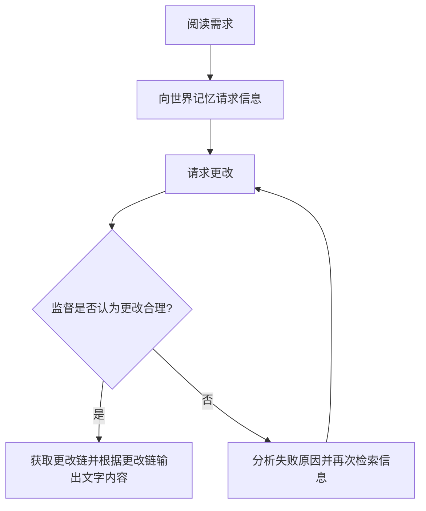
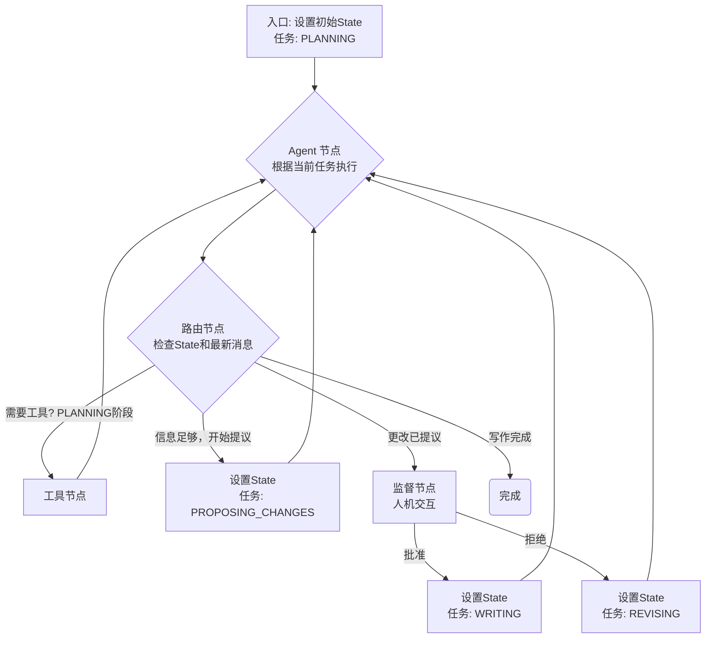


与 Blog 同步开发的开源项目: [PlotWeave](https://github.com/shadow3aaa/PlotWeave)


本文的内容是完成[小说 Agent 计划(四)-章节写作 (Chapter Writing)](../小说agent计划四#第四阶段章节写作-chapter-writing)的具体实现。

<!--more-->

## 设计

### Agent 流程设计

首先，回顾一下章节写作的设计，即之前提出的创作循环：



对比之前两步的聊天式 agent，这是一个完全不同的流程。无法直接复用之前的 `langgraph` 流程图并且只是简单的替换工具集。需要重新设计一个新的 `langgraph` 流程图。



### Agent 实现

首先需要定义上面流程图中提到的状态：

```python
class WritingState(str, Enum):
    PLANNING = "计划"
    PROPOSING_CHANGES = "开始提议"
    REVIEW = "审查"
    WRITING = "写作"
    COMPLETE = "完成"
```

然后就像 `agent.py` 中定义聊天式 agent 一样，定义流程图状态。

```python
class State(TypedDict):
    """
    写作agent的状态
    """

    messages: list[BaseMessage]
    """
    会话历史
    """

    project_id: UUID
    """
    当前项目ID
    """

    writing_state: WritingState
    """
    当前写作状态
    """

    current_chapter_index: int
    """
    当前章节索引
    """

    current_chapter_info: ChapterInfo
    """
    当前章节信息
    """

    world: World
    """
    世界记忆图谱
    """
```

然后定义 llm 节点

```python
llm = init_chat_model(
    model=config.writer_model,
    model_provider="openai",
    base_url=config.writer_base_url,
    api_key=config.writer_api_key,
)
llm_with_tools = llm.bind_tools(  # pyright: ignore[reportUnknownMemberType]
    world_tools.read_and_append_tools
    + writer_tools.full_tools
    + [switch_writing_state_tool]
)

# build_hint_prompt就是提示词构建函数，较长，这里不展示

def writer_bot(state: State):
    """
    llm节点
    """
    messages = state["messages"]
    last_message = messages[-1]
    # 注入当前的工作状态
    if isinstance(last_message.content, str):  # pyright: ignore[reportUnknownMemberType]
        last_message.content = (
            f"--- 当前模式的提示 ---\n\n{build_hint_prompt(state['writing_state'], state['current_chapter_info'])}\n\n--- 当前模式的提示 ---"
            + last_message.content
        )
    return {"messages": [llm_with_tools.invoke(state["messages"])]}
```

然后是监督节点，这里暂时占位，因为我还没想好具体怎么实现人机交互。

```python
def review_node(
    state: State,
):
    """
    监督节点
    """
    # TODO: 实现监督逻辑，现在直接通过
    return {"writing_state": WritingState.WRITING}
```

最后使用一个路由边来控制流程。

```python
def router_edge(
    state: State,
):
    """
    路由节点
    """
    messages = state["messages"]
    last_msg = messages[-1]
    writing_state = state["writing_state"]

    if isinstance(last_msg, AIMessage) and getattr(last_msg, "tool_calls", []):
        return "tools"
    else:
        match writing_state:
            case WritingState.COMPLETE:
                return END
            case WritingState.REVIEW:
                return "review"
            case _:
                return "writer_bot"
```

最后，构建流程图并编译图。

```python
graph_builder.add_node("writer_bot", writer_bot)  # pyright: ignore[reportUnknownMemberType]
graph_builder.add_edge(START, "writer_bot")
tool_node = ToolNode(tools=tools)
graph_builder.add_node("tools", tool_node)  # pyright: ignore[reportUnknownMemberType]
graph_builder.add_conditional_edges(
    "writer_bot",
    router_edge,
    # The following dictionary lets you tell the graph to interpret the condition's outputs as a specific node
    # It defaults to the identity function, but if you
    # want to use a node named something else apart from "tools",
    # You can update the value of the dictionary to something else
    # e.g., "tools": "my_tools"
    {"tools": "tools", "review": "review", END: END},
)

graph = graph_builder.compile()  # pyright: ignore[reportUnknownMemberType]
```

至此，agent 流程的主要实现就完成了，剩下的就是监督节点的实现和前端交互的实现了。

### 后端接口

不同于之前的两个阶段，小说章节写作阶段是一个比较长的流程，因此需要设计一个新的后端接口来支持这个流程。

首先需要一个可持久化的标志记录写到了哪个章节，可以保存在 metadata。

```python
class ProjectMetadata(BaseModel):
    """
    小说项目的元数据

    包括以下内容

    - name: 项目名称
    - phase: 当前阶段
    - id: 项目唯一标识符
    - writing_chapter_index: 当前正在写作的章节索引，默认为 0，表示第一章
    """

    name: str = "未命名项目"
    phase: ProjectPhase
    id: str
    writing_chapter_index: int = 0
```

然后修改写作 agent 的导航边，让它在章节写作完成后，更新项目的 `writing_chapter_index`。

```python
def router_edge(
    state: State,
):
    """
    路由边
    """
    messages = state["messages"]
    last_msg = messages[-1]
    writing_state = state["writing_state"]

    if isinstance(last_msg, AIMessage) and getattr(last_msg, "tool_calls", []):
        return "tools"
    else:
        match writing_state:
            case WritingState.COMPLETE:
                state["metadata"].writing_chapter_index += 1 # here
                return END
            case WritingState.REVIEW:
                return "review"
            case _:
                return "writer_bot"
```

最后，定义后端接口。

```python
class WritingRequest(BaseModel):
    """
    启动写作任务的请求体
    """

    chapter_index: int
    chapter_info: ChapterInfo


async def run_writing_agent_in_background(
    project_id: str, chapter_index: int, chapter_info: ChapterInfo
):
    """
    在后台执行写作 Agent 的 langgraph astream，并将事件放入对应的队列。
    """
    # 获取此任务专用的队列
    queue = writing_event_queues.get(project_id)
    if not queue:
        print(f"错误：项目 {project_id} 的事件队列未找到。")
        return

    try:
        project_instance = await active_projects.get(project_id)

        # 初始化 Agent 状态
        init_message = "你是一个专业的小说作家，正在按照预设的流程创作小说段落。"
        state = writer_agent.State(
            messages=[SystemMessage(content=init_message)],
            project_id=uuid.UUID(project_id),
            writing_state=writer_agent.WritingState.PLANNING,
            current_chapter_index=chapter_index,
            current_chapter_info=chapter_info,
            world=project_instance.world,
            metadata=project_instance.metadata,
            approved_events=[],
        )

        async for event in writer_agent.graph.astream(  # pyright: ignore[reportUnknownMemberType]
            state, config={"recursion_limit": 1145141919810}
        ):
            for _, value_update in event.items():
                if "messages" in value_update:
                    latest_message = value_update["messages"][-1]
                    stream_data = None
                    if isinstance(latest_message, AIMessage):
                        if latest_message.tool_calls:
                            tool_name = latest_message.tool_calls[0]["name"]
                            stream_data = {
                                "type": "thinking",
                                "data": f"正在调用工具: `{tool_name}`...",
                            }
                        elif latest_message.content:  # type: ignore
                            stream_data = {  # type: ignore
                                "type": "content_chunk",
                                "data": latest_message.content,  # type: ignore
                            }
                    elif isinstance(latest_message, ToolMessage):
                        stream_data = {
                            "type": "tool_result",
                            "data": f"工具 `{latest_message.name}` 返回: {latest_message.content}",  # type: ignore
                        }

                    if stream_data:
                        await queue.put(stream_data)  # type: ignore

    except Exception as e:
        error_data = {"type": "error", "data": f"写作 Agent 执行出错: {str(e)}"}
        await queue.put(error_data)  # type: ignore
        raise e
    finally:
        print(f"写作任务流结束: 项目 {project_id}, 章节索引 {chapter_index}")
        # 发送结束信号
        end_data = {"type": "end", "data": "写作任务流结束"}
        await queue.put(end_data)  # type: ignore
        # 放入一个 None 来告诉 stream_writing_progress 停止
        await queue.put(None)


@app.post("/api/projects/{project_id}/write/start", status_code=202)
async def start_writing_chapter(project_id: str, request: WritingRequest):
    """
    为指定项目启动一个章节写作任务。
    """
    # 如果已有任务在运行，则不允许启动新任务
    if project_id in writing_tasks and not writing_tasks[project_id].done():
        raise HTTPException(
            status_code=409, detail="该项目已有一个正在进行的写作任务。"
        )

    # 为这个任务创建一个新的事件队列
    writing_event_queues[project_id] = asyncio.Queue()

    # 在后台创建一个 Task 来运行 Agent
    task = asyncio.create_task(
        run_writing_agent_in_background(
            project_id, request.chapter_index, request.chapter_info
        )
    )
    writing_tasks[project_id] = task

    print(f"接收到项目 {project_id} 的写作请求，目标章节索引: {request.chapter_index}")
    return {"message": "写作任务已成功启动"}


@app.get("/api/projects/{project_id}/write/stream")
async def stream_writing_progress(project_id: str):
    """
    连接并流式传输指定项目写作任务的进度。
    """

    async def event_generator():
        """从队列中获取事件并格式化为 SSE"""
        queue = writing_event_queues.get(project_id)
        if not queue:
            # 如果队列不存在，说明任务可能还未启动或已结束
            error_data = {"type": "error", "data": "未找到写作任务流。请先启动任务。"}
            yield f"data: {json.dumps(error_data)}\n\n"
            return

        try:
            while True:
                # 从队列中等待一个事件
                event = await queue.get()
                if event is None:
                    # None 是结束信号
                    break
                yield f"data: {json.dumps(event)}\n\n"
        except asyncio.CancelledError:
            # 当客户端断开连接时，会触发此异常
            print(f"客户端断开连接，停止为项目 {project_id} 发送事件。")
        finally:
            # 清理资源
            if project_id in writing_tasks:
                del writing_tasks[project_id]
            if project_id in writing_event_queues:
                del writing_event_queues[project_id]

    return StreamingResponse(event_generator(), media_type="text/event-stream")


@app.get("/api/projects/{project_id}/write/current_chapter_index", response_model=int)
async def get_current_writing_chapter_index(project_id: str):
    """
    获取当前正在写作的章节索引。
    """
    instant = await active_projects.get(project_id)
    return instant.metadata.writing_chapter_index
```

## 前端实现

前端的类似之前的分章页面，但是需要显示写作结果和写作日志

```tsx
import { useState, useEffect, useCallback, useRef } from "react";
import { useParams } from "react-router-dom";
import {
  List,
  BookOpen,
  Sparkles,
  Save,
  Loader2,
  Circle,
  Pencil,
  Workflow,
  BrainCircuit,
  TerminalSquare,
  AlertTriangle,
  Lock, // 引入 Lock 图标
} from "lucide-react";

import { Button } from "../components/ui/button";
import {
  Card,
  CardContent,
  CardHeader,
  CardTitle,
  CardDescription,
} from "../components/ui/card";
import { ScrollArea } from "../components/ui/scroll-area";
import { Textarea } from "../components/ui/textarea";
import { type ProjectMetadata, ProjectPhase } from "../components/ProjectCard";
import { streamAsyncIterator } from "../lib/utils";
import type { ChapterInfo } from "@/lib/types";

// 为此页面定义一个更完整的章节类型
interface ChapterWritingInfo {
  title: string;
  intent: string;
  content: string;
  status: "empty" | "draft";
}

// 写作过程中的日志类型
interface WritingLog {
  id: string;
  type: "thinking" | "tool_result" | "error";
  data: string;
}

// 新的日志条目卡片组件
const LogEntryCard = ({ log }: { log: WritingLog }) => {
  let IconComponent;
  let title;
  let cardClasses;
  let iconClasses;

  switch (log.type) {
    case "thinking":
      IconComponent = BrainCircuit;
      title = "思考中...";
      cardClasses =
        "bg-blue-50 border-blue-200 dark:bg-blue-900/30 dark:border-blue-700";
      iconClasses = "text-blue-500";
      break;
    case "tool_result":
      IconComponent = TerminalSquare;
      title = "工具调用结果";
      cardClasses =
        "bg-green-50 border-green-200 dark:bg-green-900/30 dark:border-green-700";
      iconClasses = "text-green-600";
      break;
    case "error":
      IconComponent = AlertTriangle;
      title = "发生错误";
      cardClasses =
        "bg-red-50 border-red-300 dark:bg-red-900/30 dark:border-red-700";
      iconClasses = "text-red-600";
      break;
    default:
      IconComponent = Workflow;
      title = "日志";
      cardClasses = "bg-muted/50";
      iconClasses = "text-muted-foreground";
  }

  return (
    <div className={`p-3 rounded-lg border flex flex-col gap-2 ${cardClasses}`}>
      <div className="flex items-center gap-2">
        <IconComponent className={`size-4 flex-shrink-0 ${iconClasses}`} />
        <p className={`text-xs font-semibold ${iconClasses}`}>{title}</p>
      </div>
      <p className="text-xs font-mono text-foreground/80 whitespace-pre-wrap break-words">
        {log.data}
      </p>
    </div>
  );
};

function ChapterWritingPage() {
  const { projectId } = useParams<{ projectId: string }>();

  const [chapters, setChapters] = useState<ChapterWritingInfo[]>([]);
  const [selectedChapterIndex, setSelectedChapterIndex] = useState<
    number | null
  >(null);
  const [currentWritableIndex, setCurrentWritableIndex] = useState<
    number | null
  >(null); // 新增状态：当前可写作的章节索引
  const [currentContent, setCurrentContent] = useState("");
  const [isGenerating, setIsGenerating] = useState(false);
  const [isSaving, setIsSaving] = useState(false);
  const [writingLogs, setWritingLogs] = useState<WritingLog[]>([]);
  const [project, setProject] = useState<ProjectMetadata | null>(null);
  const [error, setError] = useState<string | null>(null);
  const logsEndRef = useRef<HTMLDivElement>(null);

  const isReadOnly = project?.phase !== ProjectPhase.CHAPER_WRITING;

  const fetchProjectData = useCallback(async () => {
    if (!projectId) return;
    try {
      const response = await fetch(`/api/projects/${projectId}`);
      if (!response.ok) throw new Error("获取项目信息失败");
      const data = await response.json();
      setProject(data);
    } catch (e) {
      if (e instanceof Error) setError(e.message);
    }
  }, [projectId]);

  // 新增函数：获取当前可写作的章节索引
  const fetchWritableIndex = useCallback(async () => {
    if (!projectId) return;
    try {
      const response = await fetch(
        `/api/projects/${projectId}/write/current_chapter_index`
      );
      if (!response.ok) throw new Error("获取当前写作章节索引失败");
      const data = await response.json();
      setCurrentWritableIndex(data);
    } catch (e) {
      if (e instanceof Error) setError(e.message);
    }
  }, [projectId]);

  const fetchChapters = useCallback(
    async (selectFirst = false) => {
      if (!projectId) return;
      try {
        const response = await fetch(`/api/projects/${projectId}/chapters`);
        if (!response.ok)
          throw new Error(`获取章节列表失败: ${response.statusText}`);
        const data = await response.json();

        const chapterInfos: ChapterWritingInfo[] = await Promise.all(
          (data.chapters || []).map(
            async (chap: ChapterInfo, index: number) => {
              try {
                const contentRes = await fetch(
                  `/api/projects/${projectId}/chapters/${index}`
                );
                if (contentRes.ok) {
                  const contentText = await contentRes.text();
                  return {
                    title: chap.title,
                    intent: chap.intent,
                    content: contentText,
                    status: contentText ? "draft" : "empty",
                  };
                }
                return {
                  title: chap.title,
                  intent: chap.intent,
                  content: "",
                  status: "empty",
                };
              } catch (error) {
                console.error(`获取章节 ${index} 内容失败:`, error);
                return {
                  title: chap.title,
                  intent: chap.intent,
                  content: "",
                  status: "empty",
                };
              }
            }
          )
        );

        setChapters(chapterInfos);

        if (selectFirst && chapterInfos.length > 0) {
          // 默认选中第一个或当前可写的章节
          setSelectedChapterIndex(currentWritableIndex ?? 0);
        }
      } catch (e) {
        if (e instanceof Error) setError(e.message);
      }
    },
    [projectId, currentWritableIndex]
  );

  useEffect(() => {
    fetchProjectData();
    fetchWritableIndex(); // 同时获取可写章节索引
    fetchChapters(true);
  }, [fetchProjectData, fetchChapters, fetchWritableIndex]);

  useEffect(() => {
    const selected =
      selectedChapterIndex !== null ? chapters[selectedChapterIndex] : null;
    setCurrentContent(selected?.content || "");
  }, [selectedChapterIndex, chapters]);

  useEffect(() => {
    logsEndRef.current?.scrollIntoView({ behavior: "smooth" });
  }, [writingLogs]); // 依赖项是 writingLogs，每次日志更新时触发

  const getStatusIcon = (
    status: ChapterWritingInfo["status"],
    index: number
  ) => {
    // 判断章节是否被锁定
    const isLocked =
      currentWritableIndex !== null && index > currentWritableIndex;

    if (isLocked) {
      return <Lock className="size-4 text-muted-foreground flex-shrink-0" />;
    }

    switch (status) {
      case "draft":
        return <Pencil className="size-4 text-yellow-500 flex-shrink-0" />;
      case "empty":
      default:
        return (
          <Circle className="size-4 text-muted-foreground flex-shrink-0" />
        );
    }
  };

  const handleGenerate = async () => {
    if (
      selectedChapterIndex === null ||
      !projectId ||
      !chapters[selectedChapterIndex]
    )
      return;

    setIsGenerating(true);
    setCurrentContent("");
    setWritingLogs([]);
    setError(null);

    try {
      const chapter_info = {
        title: chapters[selectedChapterIndex].title,
        intent: chapters[selectedChapterIndex].intent,
      };

      const startResponse = await fetch(
        `/api/projects/${projectId}/write/start`,
        {
          method: "POST",
          headers: { "Content-Type": "application/json" },
          body: JSON.stringify({
            chapter_index: selectedChapterIndex,
            chapter_info,
          }),
        }
      );

      if (startResponse.status !== 202) {
        const errorData = await startResponse.json();
        throw new Error(
          `启动写作任务失败: ${errorData.detail || "Unknown error"}`
        );
      }

      const progressResponse = await fetch(
        `/api/projects/${projectId}/write/stream`
      );
      if (!progressResponse.ok || !progressResponse.body) {
        throw new Error("连接到进度流失败");
      }

      for await (const chunk of streamAsyncIterator(progressResponse.body)) {
        if (chunk) {
          try {
            const event = JSON.parse(chunk);
            switch (event.type) {
              case "content_chunk":
                setCurrentContent((prev) => prev + event.data);
                break;
              case "thinking":
              case "tool_result":
              case "error":
                setWritingLogs((prev) => [
                  ...prev,
                  { id: `log-${Date.now()}-${Math.random()}`, ...event },
                ]);
                break;
              case "end":
                console.log("写作任务流结束");
                break;
            }
          } catch (e) {
            console.error("SSE 解析错误:", e);
          }
        }
      }
    } catch (err) {
      if (err instanceof Error) setError(err.message);
    } finally {
      setIsGenerating(false);
      await fetchChapters(); // 重新获取章节状态
      await fetchWritableIndex(); // 重新获取可写索引，可能会解锁下一章
    }
  };

  const handleSave = async () => {
    if (selectedChapterIndex === null || !projectId || isSaving) return;
    setIsSaving(true);
    setError(null);
    try {
      const response = await fetch(
        `/api/projects/${projectId}/chapters/${selectedChapterIndex}`,
        {
          method: "PUT",
          headers: { "Content-Type": "application/json" },
          body: JSON.stringify({ content: currentContent }),
        }
      );
      if (!response.ok) throw new Error(`保存失败: ${response.statusText}`);

      setChapters((prev) =>
        prev.map((chap, index) =>
          index === selectedChapterIndex
            ? {
                ...chap,
                content: currentContent,
                status: currentContent ? "draft" : "empty",
              }
            : chap
        )
      );
    } catch (err) {
      if (err instanceof Error) setError(err.message);
    } finally {
      setIsSaving(false);
      // 保存草稿不一定解锁下一章，但可以同步一下状态
      await fetchWritableIndex();
    }
  };

  const selectedChapter =
    selectedChapterIndex !== null ? chapters[selectedChapterIndex] : null;
  // 判断当前选中的章节是否被锁定
  const isCurrentChapterLocked =
    selectedChapterIndex !== null &&
    currentWritableIndex !== null &&
    selectedChapterIndex > currentWritableIndex;

  return (
    <div className="flex flex-col h-full gap-4">
      <div>
        <h1 className="text-3xl font-bold">章节写作</h1>
        <p className="mt-2 text-muted-foreground">
          {isReadOnly ? "（只读模式）" : "将你的创意转化为生动的文字。"}
        </p>
      </div>

      <div className="grid grid-cols-1 lg:grid-cols-3 gap-8 flex-1 min-h-0">
        <Card className="lg:col-span-1 flex flex-col min-h-0">
          <CardHeader>
            <CardTitle className="flex items-center gap-2">
              <List className="size-5" /> 章节导航
            </CardTitle>
          </CardHeader>
          <CardContent className="flex-1 overflow-hidden p-2">
            <ScrollArea className="h-full">
              <div className="space-y-2 pr-2">
                {chapters.map((chap, index) => {
                  const isLocked =
                    currentWritableIndex !== null &&
                    index > currentWritableIndex;
                  return (
                    <Button
                      key={index}
                      variant={
                        selectedChapterIndex === index ? "secondary" : "ghost"
                      }
                      className="w-full justify-start h-auto text-left"
                      onClick={() => setSelectedChapterIndex(index)}
                      disabled={isLocked} // 禁用锁定的章节
                      title={isLocked ? "请先完成前面的章节" : ""}
                    >
                      <div className="flex items-start gap-3 p-1">
                        {getStatusIcon(chap.status, index)}
                        <div>
                          <p className="font-semibold">{chap.title}</p>
                          <p className="text-xs text-muted-foreground font-normal whitespace-normal">
                            {chap.intent}
                          </p>
                        </div>
                      </div>
                    </Button>
                  );
                })}
              </div>
            </ScrollArea>
          </CardContent>
        </Card>

        <Card className="lg:col-span-2 flex flex-col min-h-0">
          {selectedChapter ? (
            <>
              <CardHeader>
                <CardTitle>{selectedChapter.title}</CardTitle>
                <CardDescription>{selectedChapter.intent}</CardDescription>
                <div className="flex items-center gap-2 pt-2">
                  <Button
                    onClick={handleGenerate}
                    disabled={
                      isGenerating ||
                      isSaving ||
                      isReadOnly ||
                      selectedChapterIndex !== currentWritableIndex // 只能生成当前可写的章节
                    }
                  >
                    {isGenerating ? (
                      <Loader2 className="size-4 mr-2 animate-spin" />
                    ) : (
                      <Sparkles className="size-4 mr-2" />
                    )}
                    {isGenerating
                      ? "生成中..."
                      : selectedChapter.status !== "empty"
                      ? "重新生成"
                      : "生成内容"}
                  </Button>
                  <Button
                    onClick={handleSave}
                    variant="outline"
                    disabled={
                      isGenerating ||
                      isSaving ||
                      isReadOnly ||
                      isCurrentChapterLocked // 不能保存未解锁的章节
                    }
                  >
                    {isSaving ? (
                      <Loader2 className="size-4 mr-2 animate-spin" />
                    ) : (
                      <Save className="size-4 mr-2" />
                    )}
                    保存
                  </Button>
                </div>
              </CardHeader>

              <CardContent className="flex-1 flex flex-col gap-4 overflow-hidden p-4">
                {/* 文本编辑区 */}
                <div className="flex-1 flex flex-col min-h-0">
                  <ScrollArea className="h-full w-full rounded-md border">
                    <Textarea
                      className="flex-1 resize-none w-full h-full p-4 border-0 focus-visible:ring-0"
                      value={currentContent}
                      onChange={(e) => setCurrentContent(e.target.value)}
                      placeholder={
                        isGenerating
                          ? "写作 Agent 正在奋笔疾书..."
                          : "点击“生成内容”开始创作，或在此处手动输入..."
                      }
                      disabled={
                        isGenerating || isReadOnly || isCurrentChapterLocked // 不能编辑未解锁的章节
                      }
                    />
                  </ScrollArea>
                </div>
                {/* Agent 日志区 */}
                <p className="text-sm font-semibold pb-2 flex items-center gap-2">
                  <Workflow className="size-4" /> Agent 工作日志
                </p>
                <div className="flex-1 flex flex-col min-h-0">
                  <ScrollArea className="h-full flex-1 bg-muted/50 rounded-md p-4">
                    {writingLogs.length > 0 ? (
                      <div className="space-y-3">
                        {writingLogs.map((log) => (
                          <LogEntryCard key={log.id} log={log} />
                        ))}
                        <div ref={logsEndRef} />
                      </div>
                    ) : (
                      <div className="text-center text-muted-foreground text-sm py-4 h-full flex items-center justify-center">
                        {isGenerating
                          ? "等待 Agent 日志..."
                          : "此处将显示写作过程中的 Agent 思考和工具调用日志。"}
                      </div>
                    )}
                  </ScrollArea>
                </div>
              </CardContent>
            </>
          ) : (
            <div className="flex flex-col items-center justify-center h-full text-muted-foreground">
              <BookOpen className="size-12 mb-4" />
              <p>
                {chapters.length > 0
                  ? "请从左侧选择一个章节开始写作"
                  : "请先在“分章”阶段创建章节"}
              </p>
            </div>
          )}
        </Card>
      </div>
    </div>
  );
}

export default ChapterWritingPage;
```

## 测试

下面是尝试测试的文段结果

```text
# 血色倒计时

深夜的研究室里，林辰的眉头紧锁，指尖在键盘上快速敲击。桌面上散落着血色玫瑰连环杀人案的卷宗，受害者都是年轻女性，现场无一例外地留下了诡异的血色玫瑰。作为顶尖犯罪心理侧写师，他试图从这些冰冷的文字和照片中，捕捉到那个隐藏在阴影中的杀手的心跳。
就在他全神贯注地分析着案件特征时，手机屏幕突然亮起。不是来电，也不是消息，而是一个血红色的倒计时数字——60。林辰震惊地拿起手机，试图关闭这个诡异的画面，但无论他如何操作，屏幕都纹丝不动，那刺目的血色数字无情地跳动着：59、58、57……
心跳随着倒计时的节奏加速，林辰的警觉性提到了最高点。这个超自然现象完全超出了他的理解范围——一个无法关闭的倒计时，一个强制占据屏幕的血色数字。他环顾四周，研究室里只有案件卷宗和电脑屏幕的微光，一切都显得如此正常，唯独这个倒计时在提醒他，某种未知的力量正在介入他的世界。
当倒计时归零的瞬间，整个世界仿佛被按下了暂停键。研究室的光线扭曲、消散，林辰感到一阵天旋地转的眩晕。当他重新站稳时，发现自己已经身处一个无边无际的纯白空间——这里没有任何物体，没有任何声音，只有永恒的白色延伸至视野的尽头。
就在他试图理解这个纯白空间的本质时，一道冰冷的声音在脑海中响起：「神选游戏系统已激活。玩家林辰，欢迎进入初始空间。」随着系统的提示，一股前所未有的力量在他体内涌动，仿佛某种沉睡的天赋被唤醒了。他的思维变得前所未有的清晰，对犯罪心理的洞察力瞬间提升到了一个新的层次。
「天赋【心理侧写LV.1】已觉醒。」系统的声音再次响起。林辰闭上眼睛，感受着这个新能力带来的变化。他发现自己能够更深入地理解犯罪者的心理动机，能够从更细微的线索中还原犯罪现场的全貌。这个天赋似乎是他专业能力的升华，但又不完全相同——它带着某种超自然的特质。
站在这个纯白的初始空间中，林辰意识到自己的人生已经发生了根本性的改变。从血色倒计时的出现，到被强制拉入这个神秘空间，再到系统的激活和天赋的觉醒——这一切都指向一个事实：他已经被选中，成为了这个名为"神选游戏"的一部分。而那个他正在调查的血色玫瑰连环杀人案，或许与这一切有着某种深刻的联系。
他深吸一口气，感受着体内涌动的力量。心理侧写LV.1——这个天赋或许正是他追查血色玫瑰连环杀人案的关键。在这个全新的起点上，林辰知道，他不仅要面对现实世界中的罪犯，还要在这个神秘的系统中找到自己的位置。血色倒计时已经结束，但真正的游戏才刚刚开始。
```

可以看到基本上可以工作，但是有些显得平淡和简单，字数也不多（大概 1000 字）。后续需要继续调优提示词等。
