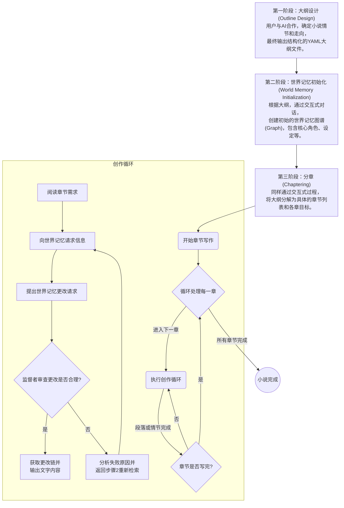
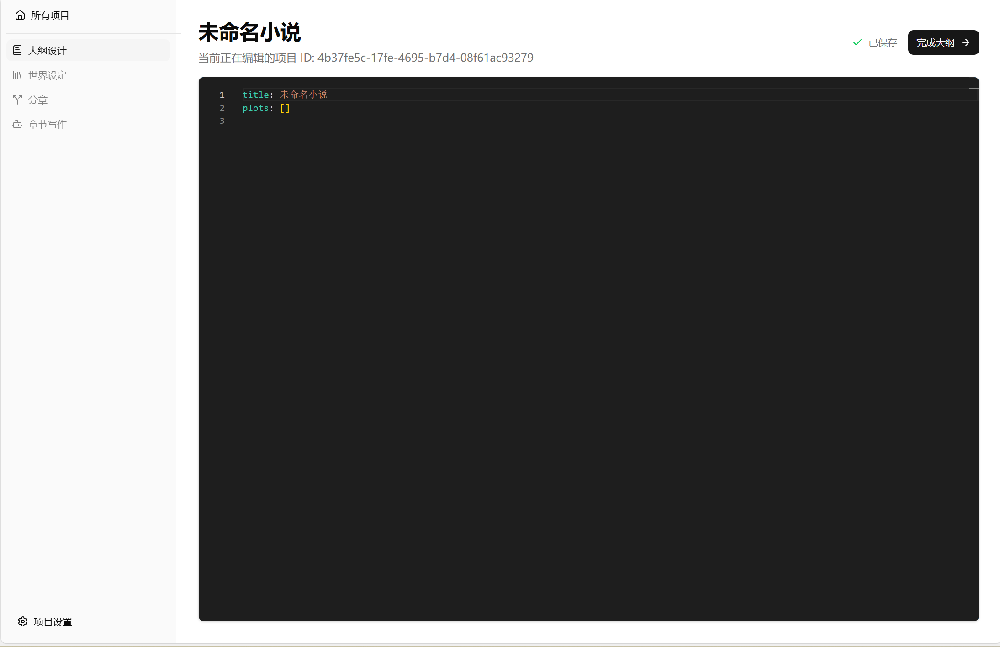
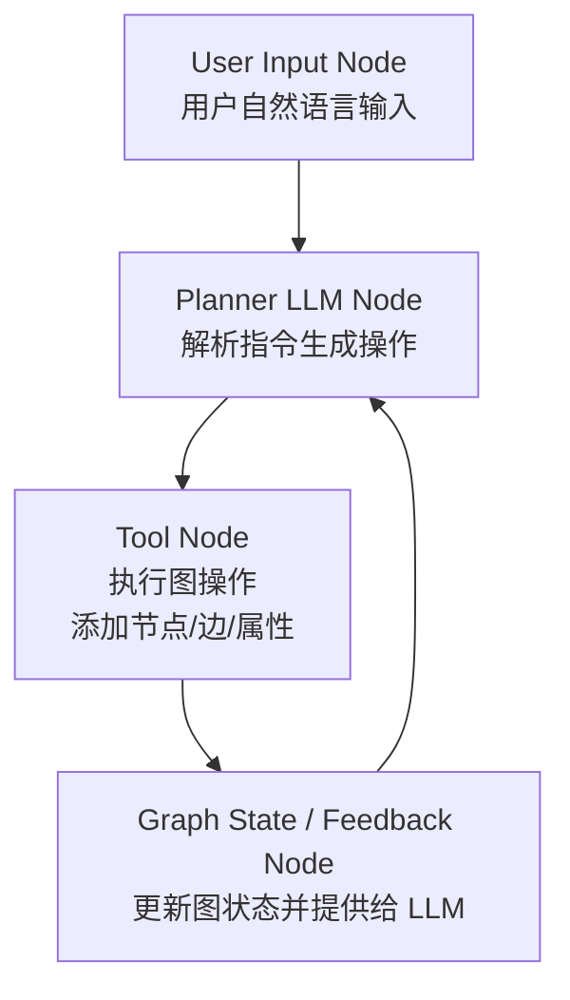
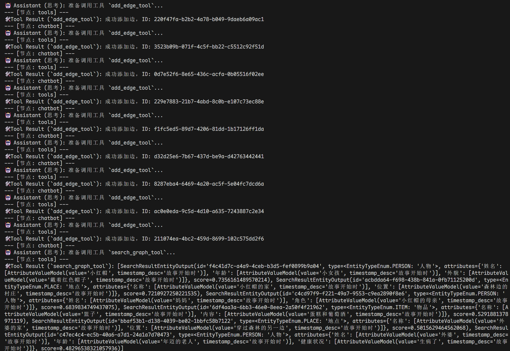
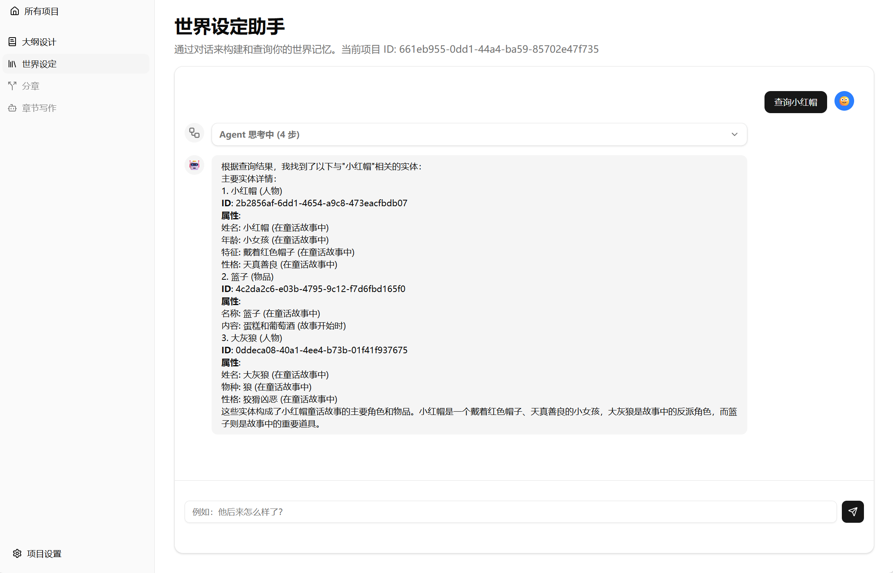


  与Blog同步开发的开源项目: [PlotWeave](https://github.com/shadow3aaa/PlotWeave)


本文的内容是完成[小说 Agent 计划(四)-第二阶段：世界记忆创建 (World Memory Initialization)](../小说agent计划四#第二阶段世界记忆创建-world-memory-initialization)的具体实现。

<!--more-->

## 锁定流程

首先，按照之前提出的流程设计，四个阶段是不可跳过，也不可逆的。比如决定了大纲设计，再回去修改就没有实际意义。



因此项目实例需要维护一个表示当前阶段的状态变量 `current_phase` ，并且在每个阶段完成后更新它。它可以保存到 `ProjectMeta` 中。

先使用一个 `Enum` 定义它

```python
class ProjectPhase(IntEnum):
    """
    小说项目的当前阶段

    - OUTLINE: 大纲设计
    - WORLD_SETUP: 世界记忆创建
    - CHAPERING: 分章
    - CHAPER_WRITING: 章节写作
    """

    OUTLINE = 0
    WORLD_SETUP = 1
    CHAPERING = 2
    CHAPER_WRITING = 3
```

然后在 `ProjectMeta` 中添加它

```python
class ProjectMetadata(BaseModel):
    """
    小说项目的元数据

    包括以下内容

    - name: 项目名称
    - phase: 当前阶段
    - id: 项目唯一标识符
    """

    name: str = "未命名项目"
    phase: ProjectPhase
    id: str
```

在前端使用神秘的类型体操做出相同的定义

```tsx
export type ProjectPhase = (typeof ProjectPhase)[keyof typeof ProjectPhase];

export interface ProjectMetadata {
  id: string;
  phase: ProjectPhase;
  name: string;
}

interface ProjectCardProps {
  project: ProjectMetadata;
  onDelete: (projectId: string) => void;
  onEnter: (projectId: string) => void;
}
```

修改一下前端进入时的导航逻辑，改为根据 `current_phase` 进入不同的页面

```tsx
const handleEnterProject = (project: ProjectMetadata) => {
  const { id, phase } = project;
  switch (phase) {
    case ProjectPhase.OUTLINE:
      navigate(`/projects/${id}/outline`);
      break;
    case ProjectPhase.WORLD_SETUP:
      navigate(`/projects/${id}/world-setup`);
      break;
    case ProjectPhase.CHAPERING:
      navigate(`/projects/${id}/chaptering`);
      break;
    case ProjectPhase.CHAPER_WRITING:
      navigate(`/projects/${id}/chapter-writing`);
      break;
    default:
      // 如果没有匹配的 phase，可以导航到一个默认页面，比如大纲页
      navigate(`/projects/${id}`);
      break;
  }
};
```

```tsx
function App() {
  // 占位符
  const WorldSetupPage = () => <div>世界设定页面</div>;
  const ChapteringPage = () => <div>分章页面</div>;
  const ChapterWritingPage = () => <div>章节写作页面</div>;
  return (
    <Routes>
      <Route path="/" element={<ProjectListPage />} />
      <Route path="/projects" element={<ProjectListPage />} />

      <Route path="/projects/:projectId" element={<ProjectLayout />}>
        <Route index element={<OutlinePage />} />
        <Route path="outline" element={<OutlinePage />} />
        <Route path="world-setup" element={<WorldSetupPage />} />
        <Route path="chaptering" element={<ChapteringPage />} />
        <Route path="chapter-writing" element={<ChapterWritingPage />} />
      </Route>
    </Routes>
  );
}

export default App;
```

修改已经完成的大纲编辑页面，让它在非本阶段时不可编辑

```tsx
const handleAutoSave = useCallback(
  async (textToSave: string) => {
    // 如果不是大纲阶段，则不允许保存
    if (!projectId || projectPhase !== ProjectPhase.OUTLINE) return;
    setSaveStatus("saving");
```

修改侧边栏，禁止跳转到比当前阶段更高的阶段

```tsx
const [project, setProject] = useState<ProjectMetadata | null>(null);

useEffect(() => {
  const fetchProject = async () => {
    try {
      const response = await fetch(`/api/projects/${projectId}`);
      if (response.ok) {
        const data = await response.json();
        setProject(data);
      } else {
        console.error("获取项目详情失败");
      }
    } catch (error) {
      console.error("获取项目详情时出错:", error);
    }
  };

  if (projectId) {
    fetchProject();
  }
}, [projectId]);

// 辅助函数，用于判断某个阶段是否应该被禁用
const isPhaseDisabled = (phase: ProjectPhase) => {
  if (!project) return true; // 如果项目数据还未加载，则禁用
  return project.phase < phase;
};

// ......

{/* 大纲设计 */}
<NavLink
  to={`/projects/${projectId}/outline`}
  // 使用 pointer-events-none 防止在禁用时点击
  className={
    isPhaseDisabled(ProjectPhase.OUTLINE)
      ? "pointer-events-none"
      : ""
  }
>
  {({ isActive }) => (
    <SidebarMenuButton
      isActive={isActive}
      disabled={isPhaseDisabled(ProjectPhase.OUTLINE)}
    >
      <BookText className="h-4 w-4" />
      <span>大纲设计</span>
    </SidebarMenuButton>
  )}
</NavLink>
</SidebarMenuItem>

{/* 世界设定 */}
<SidebarMenuItem>
<NavLink
  to={`/projects/${projectId}/world-setup`}
  className={
    isPhaseDisabled(ProjectPhase.WORLD_SETUP)
      ? "pointer-events-none"
      : ""
  }
>
  {({ isActive }) => (
    <SidebarMenuButton
      isActive={isActive}
      disabled={isPhaseDisabled(ProjectPhase.WORLD_SETUP)}
    >
      <Library className="h-4 w-4" />
      <span>世界设定</span>
    </SidebarMenuButton>
  )}
</NavLink>
</SidebarMenuItem>

{/* 分章 */}
<SidebarMenuItem>
  <NavLink
    to={`/projects/${projectId}/chaptering`}
    className={
      isPhaseDisabled(ProjectPhase.CHAPERING)
        ? "pointer-events-none"
        : ""
    }
  >
    {({ isActive }) => (
      <SidebarMenuButton
        isActive={isActive}
        disabled={isPhaseDisabled(ProjectPhase.CHAPERING)}
      >
        <Split className="h-4 w-4" />
        <span>分章</span>
      </SidebarMenuButton>
    )}
  </NavLink>
</SidebarMenuItem>

{/* 章节写作 */}
<SidebarMenuItem>
<NavLink
  to={`/projects/${projectId}/chaptering`}
  className={
    isPhaseDisabled(ProjectPhase.CHAPERING)
      ? "pointer-events-none"
      : ""
  }
>
  {({ isActive }) => (
    <SidebarMenuButton
      isActive={isActive}
      disabled={isPhaseDisabled(ProjectPhase.CHAPERING)}
    >
      <Bot className="h-4 w-4" />
      <span>章节写作</span>
    </SidebarMenuButton>
  )}
</NavLink>
```

接下来在大纲界面添加一个按钮，表示大纲设计完成，进入下一个阶段

```tsx
import { useState, useEffect, useCallback, useRef } from "react";
import { useParams, useNavigate } from "react-router-dom";
import YAML from "yaml";
import Editor from "@monaco-editor/react";
import { Loader2, Check, AlertCircle, ArrowRight } from "lucide-react";
import { ProjectPhase, type ProjectMetadata } from "@/components/ProjectCard";
import { Button } from "@/components/ui/button";

interface OutlineData {
  title: string;
  plots: string[];
}

// 定义保存状态的类型
type SaveStatus = "idle" | "saving" | "success" | "error";

/**
 * 验证数据是否符合 OutlineData 接口的结构和类型
 * @param data - 需要被验证的数据
 * @returns 如果数据有效则返回 true，否则返回 false
 */
function isValidOutlineData(data: unknown): data is OutlineData {
  // Check if data is a non-null, non-array object
  if (typeof data !== "object" || data === null || Array.isArray(data)) {
    return false;
  }

  // Cast to a record to safely check for properties
  const potentialOutline = data as Record<string, unknown>;

  // Check for the 'title' property and its type
  const hasTitle = typeof potentialOutline.title === "string";

  // Check for the 'plots' property and its type (must be an array)
  const hasPlots = Array.isArray(potentialOutline.plots);

  if (!hasTitle || !hasPlots) {
    return false;
  }

  // If 'plots' is an array, check if all its elements are strings
  return (potentialOutline.plots as unknown[]).every(
    (plot: unknown) => typeof plot === "string"
  );
}

function OutlinePage() {
  const { projectId } = useParams<{ projectId: string }>();
  const navigate = useNavigate();

  const [outline, setOutline] = useState<OutlineData | null>(null);
  const [project, setProject] = useState<ProjectMetadata | null>(null);
  const [projectPhase, setProjectPhase] = useState<ProjectPhase | null>(null);
  const [yamlText, setYamlText] = useState("");
  const [isLoading, setIsLoading] = useState(true);
  const [error, setError] = useState<string | null>(null);

  const [saveStatus, setSaveStatus] = useState<SaveStatus>("idle");
  const isInitialMount = useRef(true);

  const fetchData = useCallback(async () => {
    if (!projectId) return;
    setIsLoading(true);
    try {
      const [outlineResponse, projectResponse] = await Promise.all([
        fetch(`/api/projects/${projectId}/outline`),
        fetch(`/api/projects/${projectId}`),
      ]);

      if (!outlineResponse.ok) {
        throw new Error(`获取大纲失败: ${outlineResponse.statusText}`);
      }
      if (!projectResponse.ok) {
        throw new Error(`获取项目信息失败: ${projectResponse.statusText}`);
      }

      const outlineData: OutlineData = await outlineResponse.json();
      const projectData: ProjectMetadata = await projectResponse.json();

      setOutline(outlineData);
      setProject(projectData);
      setProjectPhase(projectData.phase);
      setYamlText(YAML.stringify(outlineData));
      setSaveStatus("success");
    } catch (e) {
      if (e instanceof Error) setError(e.message);
    } finally {
      setIsLoading(false);
    }
  }, [projectId]);

  useEffect(() => {
    fetchData();
  }, [fetchData]);

  const handleAutoSave = useCallback(
    async (textToSave: string) => {
      if (!projectId || projectPhase !== ProjectPhase.OUTLINE) return;
      setSaveStatus("saving");

      try {
        const parsedData = YAML.parse(textToSave);
        if (!isValidOutlineData(parsedData)) {
          throw new Error("YAML 结构或类型错误. 必须包含 'title' 和 'plots'.");
        }

        const response = await fetch(`/api/projects/${projectId}/outline`, {
          method: "PUT",
          headers: { "Content-Type": "application/json" },
          body: JSON.stringify(parsedData),
        });

        if (!response.ok) {
          throw new Error("保存至服务器失败");
        }

        setOutline(parsedData);
        setSaveStatus("success");
      } catch (e) {
        console.error(e);
        setSaveStatus("error");
      }
    },
    [projectId, projectPhase]
  );

  useEffect(() => {
    if (isInitialMount.current) {
      isInitialMount.current = false;
      return;
    }
    if (projectPhase !== ProjectPhase.OUTLINE) return;

    const debounceTimer = setTimeout(() => {
      handleAutoSave(yamlText);
    }, 150);

    return () => clearTimeout(debounceTimer);
  }, [yamlText, handleAutoSave, projectPhase]);

  const handleEditorChange = (value: string | undefined) => {
    if (saveStatus === "success" || saveStatus === "error") {
      setSaveStatus("idle");
    }
    setYamlText(value || "");
  };

  const handleAdvancePhase = async () => {
    if (!projectId || !project || saveStatus !== "success") {
      alert("请确保所有更改已成功保存后再进入下一阶段。");
      return;
    }

    try {
      const response = await fetch(`/api/projects/${projectId}`, {
        method: "PUT",
        headers: {
          "Content-Type": "application/json",
        },
        body: JSON.stringify({
          ...project,
          phase: ProjectPhase.WORLD_SETUP,
        }),
      });

      if (!response.ok) {
        throw new Error("推进项目阶段失败");
      }

      // 推进成功后，导航到新阶段的页面
      navigate(`/projects/${projectId}/world-setup`);
      window.location.reload(); // 刷新以确保侧边栏等状态正确更新
    } catch (err) {
      if (err instanceof Error) {
        setError(err.message);
      }
    }
  };

  if (isLoading) {
    return <div>正在加载大纲...</div>;
  }

  if (error) {
    return <div className="text-red-500">错误: {error}</div>;
  }

  const isReadOnly = projectPhase !== ProjectPhase.OUTLINE;

  const SaveStatusIndicator = () => (
    <div className="flex items-center gap-2 text-sm text-muted-foreground w-40 justify-end">
      {" "}
      {/* 增加了宽度到 w-40 */}
      {isReadOnly ? (
        <span>（只读模式）</span>
      ) : (
        <>
          {saveStatus === "saving" && (
            <>
              <Loader2 className="size-4 animate-spin" />
              <span>正在保存...</span>
            </>
          )}
          {saveStatus === "success" && (
            <>
              <Check className="size-4 text-green-500" />
              <span>已保存</span>
            </>
          )}
          {saveStatus === "error" && (
            <>
              <AlertCircle className="size-4 text-red-500" />
              <span>格式或结构错误</span>
            </>
          )}
        </>
      )}
    </div>
  );

  return (
    <div className="flex flex-col h-full gap-4">
      <div className="flex justify-between items-center">
        <div>
          <h1 className="text-3xl font-bold">
            {outline ? outline.title : "大纲设计"}
          </h1>
          <p className="mt-2 text-muted-foreground">
            当前正在编辑的项目 ID: {projectId}
          </p>
        </div>
        <div className="flex items-center gap-4">
          <SaveStatusIndicator />
          {projectPhase === ProjectPhase.OUTLINE && (
            <Button
              onClick={handleAdvancePhase}
              disabled={saveStatus !== "success"}
              title="确保所有修改都已保存后再继续"
            >
              <span>完成大纲</span>
              <ArrowRight className="h-4 w-4" />
            </Button>
          )}
        </div>
      </div>
      <div className="flex-1 min-h-0 border rounded-md overflow-hidden shadow-sm">
        <Editor
          language="yaml"
          theme="vs-dark"
          value={yamlText}
          onChange={handleEditorChange}
          options={{
            readOnly: isReadOnly,
            minimap: { enabled: false },
            fontSize: 14,
            wordWrap: "on",
            padding: { top: 16 },
            scrollBeyondLastLine: false,
          }}
        />
      </div>
    </div>
  );
}

export default OutlinePage;
```



现在我们已经完成了阶段锁定和大纲编辑锁定的功能，可以开始设计第二阶段的具体实现了。

## 世界记忆创建

### 前端初始化

先放个骨架界面并更新路由

```tsx
import { useParams } from "react-router-dom";

function WorldSetupPage() {
  const { projectId } = useParams();

  return (
    <div>
      <h1 className="text-3xl font-bold">世界记忆初始化</h1>
      <p className="mt-2 text-muted-foreground">
        当前正在编辑的项目 ID: {projectId}
      </p>
    </div>
  );
}

export default WorldSetupPage;
```

### 实现后端 Agent

可视化世界记忆图谱的实现比较复杂，我们首先实现让 agent 和用户对话以编辑图谱。

这代表先需要实现一个 agent 支持空白的世界记忆图谱。

这里使用 `langgraph` 来实现 agent 更加简单且合适

```bash
uv add langgraph langsmith "langchain[openai]"
```

创建一个 `world_setup_agent.py` 表示这个专门用于世界记忆创建的 agent。首先为图操作定义对应的工具调用。

要创建一个基于 `langgraph` 的 agent，首先需要明确我们的 agent 流程图，如下



首先定义图状态

```python
class State(TypedDict):
    messages: Annotated[list[BaseMessage], operator.add]
    """
    会话历史
    """

    world: World
    """
    世界记忆图谱
    """

graph_builder = StateGraph(State)
```

接下来定义可用的工具，这里比较长就不完整给出了

```python
tools: list[BaseTool] = [
    add_entity_tool,
    add_edge_tool,
    search_graph_tool,
    get_entity_tool,
    get_edge_tool,
    get_related_edges_tool,
    get_edges_between_entities_tool,
    delete_entity_tool,
    delete_edge_tool,
    append_entity_attributes_tool,
    replace_entity_attributes_tool,
    append_edge_attributes_tool,
    replace_edge_attributes_tool,
]
```

然后是 chatbot 节点和 planner 节点

```python

llm = init_chat_model(
    model=config.writer_model,
    model_provider="openai",
    base_url=config.writer_base_url,
    api_key=config.writer_api_key,
)
llm_with_tools = llm.bind_tools(tools)  # pyright: ignore[reportUnknownMemberType]


def chatbot(state: State):
    return {"messages": [llm_with_tools.invoke(state["messages"])]}


graph_builder.add_node("chatbot", chatbot)  # pyright: ignore[reportUnknownMemberType]
graph_builder.add_edge(START, "chatbot")


tool_node = ToolNode(tools=tools)
graph_builder.add_node("tools", tool_node)  # pyright: ignore[reportUnknownMemberType]
graph_builder.add_edge("tools", "chatbot")


def route_tools(state: State) -> str:
    """
    如果最后一条消息是 AIMessage 且包含 tool_calls，
    就路由到 'tools' 节点，否则直接结束。
    """
    messages = state["messages"]
    last_msg = messages[-1]

    if isinstance(last_msg, AIMessage) and getattr(last_msg, "tool_calls", []):
        return "tools"
    else:
        return END


graph_builder.add_conditional_edges(
    "chatbot",
    route_tools,
    # The following dictionary lets you tell the graph to interpret the condition's outputs as a specific node
    # It defaults to the identity function, but if you
    # want to use a node named something else apart from "tools",
    # You can update the value of the dictionary to something else
    # e.g., "tools": "my_tools"
    {"tools": "tools", END: END},
)
```

在 `main.py` 测试一下



看起来工作良好。

## 前端对话界面

### 后端 api

这种 agent 对话不能使用简单的 `FASTAPI` 的实现，因为可能涉及流式内容，这里使用一个 server-sent events (SSE) 的实现。

`server.py` 添加

```python

class ChatRequest(BaseModel):
    """
    聊天请求的请求体
    """

    message: str
    history: list[dict[str, str]] = []


async def stream_agent_response(
    project_id: str, user_message: str, history: list[dict[str, str]]
):
    """
    一个异步生成器，用于流式传输 Agent 的响应。
    """
    project_instance = await active_projects.get(project_id)
    if not project_instance:
        error_data = {"type": "error", "data": "项目未加载或不存在。"}
        yield f"data: {json.dumps(error_data)}\n\n"
        return

    # 从前端发送的 history 构建 LangChain 的消息列表
    messages: list[BaseMessage] = []
    for msg in history:
        role = msg.get("role")
        content = msg.get("content", "")
        # 我们只将用户和最终的助手回复添加到历史记录中
        if role == "user":
            messages.append(HumanMessage(content=content))
        elif role == "assistant" and msg.get("type") == "final":
            messages.append(AIMessage(content=content))

    # 添加当前用户的新消息
    messages.append(HumanMessage(content=user_message))

    # 使用包含完整历史的消息列表初始化 Agent 状态
    state: agent.State = {
        "messages": messages,
        "world": project_instance.world,
    }

    try:
        # 进行响应
        async for event in graph.astream(state, config={"recursion_limit": 100}):  # pyright: ignore[reportUnknownMemberType]
            for _, value_update in event.items():
                if "messages" in value_update:
                    new_messages = value_update["messages"]
                    if new_messages:
                        latest_message = new_messages[-1]
                        # (这部分的流式输出逻辑保持不变)
                        if isinstance(latest_message, AIMessage):
                            if latest_message.tool_calls:
                                tool_name = latest_message.tool_calls[0]["name"]
                                stream_data = {
                                    "type": "thinking",
                                    "data": f"正在调用工具: `{tool_name}`...",
                                }
                                yield f"data: {json.dumps(stream_data)}\n\n"
                            elif latest_message.content:  # type: ignore
                                stream_data = {  # type: ignore
                                    "type": "token",
                                    "data": latest_message.content,  # type: ignore
                                }
                                yield f"data: {json.dumps(stream_data)}\n\n"
                        elif isinstance(latest_message, ToolMessage):
                            stream_data = {
                                "type": "tool_result",
                                "data": f"工具 `{latest_message.name}` 返回: {latest_message.content}",  # type: ignore
                            }
                            yield f"data: {json.dumps(stream_data)}\n\n"

    except Exception as e:
        print(f"Agent stream error: {e}")
        error_data = {"type": "error", "data": f"Agent 执行出错: {str(e)}"}
        yield f"data: {json.dumps(error_data)}\n\n"
    finally:
        end_data = {"type": "end", "data": "Stream ended"}
        yield f"data: {json.dumps(end_data)}\n\n"


@app.post("/api/projects/{project_id}/chat/stream")
async def chat_stream(project_id: str, request: ChatRequest):
    """
    与指定项目的 Agent 进行流式对话。
    """
    return StreamingResponse(
        stream_agent_response(project_id, request.message, request.history),
        media_type="text/event-stream",
    )
```

### 前端页面

修改之前的 `WorldSetupPage` 页面，添加对话界面

```tsx
import { useState, useRef, type FormEvent, useEffect, useMemo } from "react";
import { useParams } from "react-router-dom";
import ReactMarkdown from "react-markdown";
import { Send, ClipboardCopy, Check, Workflow } from "lucide-react";

import { Button } from "@/components/ui/button";
import { Card, CardContent, CardFooter } from "@/components/ui/card";
import { Input } from "@/components/ui/input";
import { ScrollArea } from "@/components/ui/scroll-area";
import {
  Accordion,
  AccordionContent,
  AccordionItem,
  AccordionTrigger,
} from "@/components/ui/accordion";
import { cn } from "@/lib/utils";

interface Message {
  id: string;
  role: "user" | "assistant";
  content: string;
  type?: "thinking" | "tool_result" | "final";
}

type GroupedMessage =
  | Message
  | { type: "tool_group"; messages: Message[]; id: string };

// 解析流的辅助函数
async function* streamAsyncIterator(stream: ReadableStream<Uint8Array>) {
  const reader = stream.getReader();
  const decoder = new TextDecoder();
  let buffer = "";
  try {
    while (true) {
      const { done, value } = await reader.read();
      if (done) break;
      buffer += decoder.decode(value, { stream: true });
      const parts = buffer.split("\n\n");
      buffer = parts.pop() || "";
      for (const part of parts) {
        if (part.startsWith("data: ")) {
          yield part.substring(6);
        }
      }
    }
  } finally {
    reader.releaseLock();
  }
}

// 用于复制文本的 Hook
const useCopyToClipboard = () => {
  const [isCopied, setIsCopied] = useState(false);
  const copy = (text: string) => {
    navigator.clipboard.writeText(text);
    setIsCopied(true);
    setTimeout(() => setIsCopied(false), 2000);
  };
  return { isCopied, copy };
};

// 单条工具日志组件
const ToolLogEntry = ({ message }: { message: Message }) => {
  const { isCopied, copy } = useCopyToClipboard();
  const title = message.type === "thinking" ? "Agent 思考" : "工具结果";

  return (
    <div className="relative group/log">
      <p className="text-xs font-semibold text-muted-foreground mb-1">
        {title}
      </p>
      <pre className="text-xs whitespace-pre-wrap font-mono bg-muted p-3 rounded-md">
        <code>{message.content}</code>
      </pre>
      <Button
        variant="ghost"
        size="icon"
        className="absolute top-0 right-0 h-6 w-6 opacity-0 group-hover/log:opacity-100 transition-opacity"
        onClick={() => copy(message.content)}
      >
        {isCopied ? (
          <Check className="size-3 text-green-500" />
        ) : (
          <ClipboardCopy className="size-3" />
        )}
      </Button>
    </div>
  );
};

// 工具调用组组件
const ToolGroupMessage = ({ messages }: { messages: Message[] }) => {
  return (
    <div className="flex items-start gap-3">
      <div className="bg-muted rounded-full size-8 flex-shrink-0 flex items-center justify-center">
        <Workflow className="size-5 text-muted-foreground" />
      </div>
      <div className="w-full max-w-[80%]">
        <Accordion type="single" collapsible className="w-full">
          <AccordionItem
            value="item-1"
            className="border rounded-lg bg-background shadow-sm px-3"
          >
            <AccordionTrigger className="py-2 text-sm text-muted-foreground hover:no-underline font-semibold">
              Agent 思考中 ({messages.length} 步)
            </AccordionTrigger>
            <AccordionContent className="border-t pt-3 space-y-3">
              {messages.map((msg) => (
                <ToolLogEntry key={msg.id} message={msg} />
              ))}
            </AccordionContent>
          </AccordionItem>
        </Accordion>
      </div>
    </div>
  );
};

function WorldSetupPage() {
  const { projectId } = useParams<{ projectId: string }>();
  const [messages, setMessages] = useState<Message[]>([]);
  const [input, setInput] = useState("");
  const [isLoading, setIsLoading] = useState(false);
  const messagesEndRef = useRef<HTMLDivElement>(null);

  useEffect(() => {
    messagesEndRef.current?.scrollIntoView({ behavior: "smooth" });
  }, [messages]);

  // 使用 useMemo 对消息进行分组，避免每次渲染都重新计算
  const groupedMessages = useMemo(() => {
    const groups: GroupedMessage[] = [];
    let currentToolGroup: Message[] = [];

    for (const message of messages) {
      const isToolMessage =
        message.type === "thinking" || message.type === "tool_result";

      if (isToolMessage) {
        currentToolGroup.push(message);
      } else {
        if (currentToolGroup.length > 0) {
          groups.push({
            type: "tool_group",
            messages: currentToolGroup,
            id: `group-${currentToolGroup[0].id}`,
          });
          currentToolGroup = [];
        }
        groups.push(message);
      }
    }
    // 处理末尾的工具组
    if (currentToolGroup.length > 0) {
      groups.push({
        type: "tool_group",
        messages: currentToolGroup,
        id: `group-${currentToolGroup[0].id}`,
      });
    }

    return groups;
  }, [messages]);

  const handleSubmit = async (e: FormEvent) => {
    e.preventDefault();
    if (!input.trim() || isLoading || !projectId) return;

    setIsLoading(true);
    const currentUserMessage = input;
    const historyBeforeSubmit = messages; // 捕获提交前的历史记录

    // 更新UI
    const userMessage: Message = {
      id: `user-${Date.now()}`,
      role: "user",
      content: currentUserMessage,
    };
    const assistantPlaceholder: Message = {
      id: `assistant-${Date.now()}`,
      role: "assistant",
      content: "",
      type: "final",
    };
    setMessages((prev) => [...prev, userMessage, assistantPlaceholder]);
    setInput("");

    try {
      const response = await fetch(`/api/projects/${projectId}/chat/stream`, {
        method: "POST",
        headers: { "Content-Type": "application/json" },
        body: JSON.stringify({
          message: currentUserMessage,
          history: historyBeforeSubmit,
        }),
      });

      if (!response.ok || !response.body)
        throw new Error(`请求失败: ${response.statusText}`);

      for await (const chunk of streamAsyncIterator(response.body)) {
        if (chunk) {
          try {
            const parsedData = JSON.parse(chunk);
            const assistantMessageId = assistantPlaceholder.id;

            switch (parsedData.type) {
              case "thinking":
              case "tool_result":
                // 将工具消息插入到占位符之前
                setMessages((prev) => {
                  const last = prev[prev.length - 1];
                  const rest = prev.slice(0, -1);
                  const newLog: Message = {
                    id: `log-${Date.now()}-${Math.random()}`,
                    role: "assistant",
                    content: parsedData.data,
                    type: parsedData.type,
                  };
                  return [...rest, newLog, last];
                });
                break;
              case "token":
                setMessages((prev) =>
                  prev.map((msg) =>
                    msg.id === assistantMessageId
                      ? { ...msg, content: msg.content + parsedData.data }
                      : msg
                  )
                );
                break;
              case "end":
                break;
              case "error":
                setMessages((prev) =>
                  prev.map((msg) =>
                    msg.id === assistantMessageId
                      ? { ...msg, content: `**错误:** ${parsedData.data}` }
                      : msg
                  )
                );
                break;
            }
          } catch (error) {
            console.error("解析SSE数据块失败:", chunk, error);
          }
        }
      }
    } catch (error) {
      console.error("流式请求失败:", error);
      setMessages((prev) =>
        prev.map((msg) =>
          msg.id === assistantPlaceholder.id
            ? { ...msg, content: msg.content + `\n\n**连接错误！**` }
            : msg
        )
      );
    } finally {
      setIsLoading(false);
    }
  };

  return (
    <div className="flex flex-col h-full gap-4">
      <div>
        <h1 className="text-3xl font-bold">世界设定助手</h1>
        <p className="mt-2 text-muted-foreground">
          通过对话来构建和查询你的世界记忆。当前项目 ID: {projectId}
        </p>
      </div>
      <Card className="flex-1 grid grid-rows-[1fr,auto] min-h-0">
        <CardContent className="overflow-hidden p-4">
          <ScrollArea className="h-full pr-4">
            <div className="space-y-4">
              {groupedMessages.map((item) => {
                if (item.type === "tool_group") {
                  return (
                    <ToolGroupMessage key={item.id} messages={item.messages} />
                  );
                }

                const m = item; // It's a regular message
                return (
                  <div
                    key={m.id}
                    className={cn(
                      "flex items-start gap-3",
                      m.role === "user" ? "justify-end" : ""
                    )}
                  >
                    {m.role === "assistant" && (
                      <div className="bg-muted rounded-full size-8 flex-shrink-0 flex items-center justify-center">
                        🤖
                      </div>
                    )}
                    <div
                      className={cn(
                        "rounded-lg px-4 py-2 max-w-[80%]",
                        m.role === "user"
                          ? "bg-primary text-primary-foreground"
                          : "bg-muted"
                      )}
                    >
                      <div className="prose dark:prose-invert text-sm max-w-none">
                        <ReactMarkdown>{m.content || "..."}</ReactMarkdown>
                      </div>
                    </div>
                    {m.role === "user" && (
                      <div className="bg-blue-500 text-white rounded-full size-8 flex-shrink-0 flex items-center justify-center">
                        🙂
                      </div>
                    )}
                  </div>
                );
              })}
              <div ref={messagesEndRef} />
            </div>
          </ScrollArea>
        </CardContent>
        <CardFooter className="p-4 border-t">
          <form
            onSubmit={handleSubmit}
            className="flex w-full items-center space-x-2"
          >
            <Input
              value={input}
              placeholder="例如：他后来怎么样了？"
              onChange={(e) => setInput(e.target.value)}
              disabled={isLoading}
              autoComplete="off"
            />
            <Button
              type="submit"
              disabled={isLoading}
              size="icon"
              className="flex-shrink-0"
            >
              <Send className="size-4" />
              <span className="sr-only">发送</span>
            </Button>
          </form>
        </CardFooter>
      </Card>
    </div>
  );
}

export default WorldSetupPage;
```

至此，第二阶段的世界记忆创建功能的核心部分已经完成。用户现在可以通过对话与 agent 交互，逐步构建和完善他们的小说世界记忆图谱。


