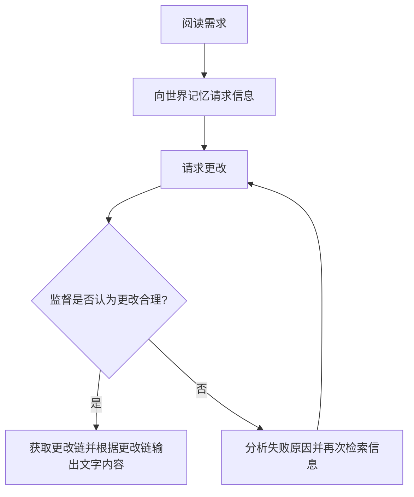
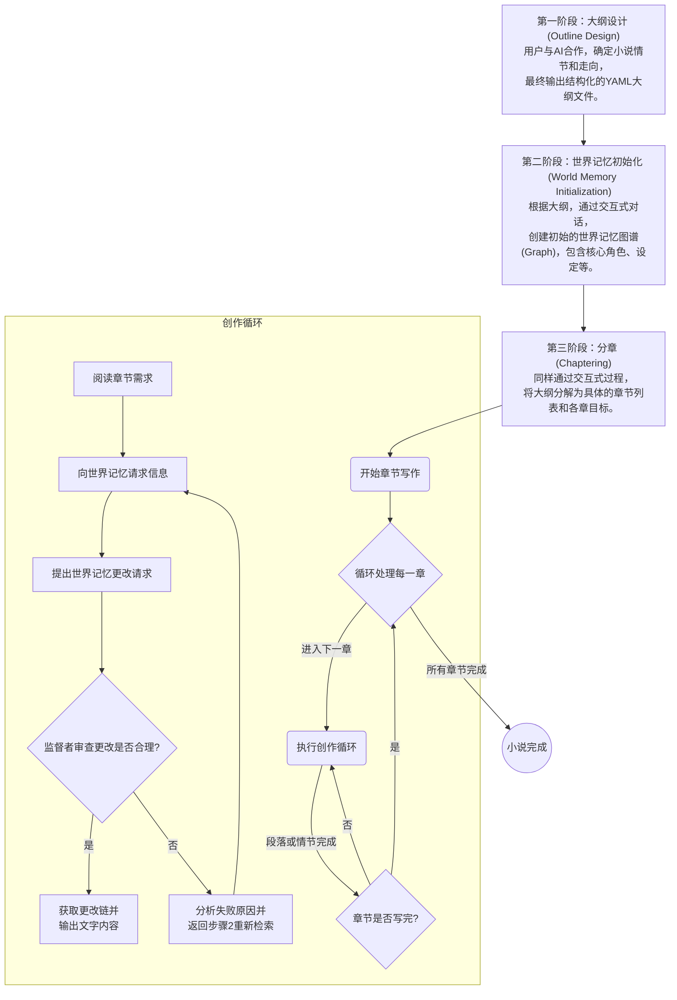

[小说 Agent 计划(三)-关系图检索](../小说Agent计划三)中已经完成了世界记忆的基本功能开发，接下来开始设计 `小说Agent` 的整体流程。

<!--more-->

## 设计

在设计 `小说Agent` 流程之前，先回顾一下[小说 Agent 计划(一)](../小说Agent计划一#问题所在)中提出的创作循环



这指出了创作循环的最小单元，我们还需要在外围设计一个更大的循环来控制创作的整体进度，这包括创建初始世界记忆、生成大纲、章节等。

## 整体流程设计

一般的创作流程可以分为以下几个阶段：

- 第一阶段：构思与准备 (Conception & Preparation)
- 第二阶段：规划与大纲 (Planning & Outlining)
- 第三阶段：初稿写作 (Drafting)
- 第四阶段：修改与润色 (Revising & Polishing)
- 第五阶段：最终审查与发布 (Final Review & Publishing)

对 `小说Agent` 来说，我认为可以将这些阶段简化为以下几个主要阶段：

- 第一阶段：大纲设计 (Outline Design)

  确定小说的大纲，确定主要情节和故事走向。

- 第二阶段：世界记忆初始化 (World Memory Initialization)

  于此阶段建立最初的世界记忆，包括角色、设定、背景等。

- 第三阶段：分章 (Chaptering)

  根据大纲将故事分成多个章节，确定每章的主要内容。

- 第四阶段：章节写作 (Chapter Writing)

  按之前提出的创作循环逐章写作。

接下来我会详细设计每个阶段的流程。

### 第一阶段：大纲设计 (Outline Design)

首先要明确的是大纲如何产生，无非是下面三种方式:

- 完全由用户提供
- 用户和 Agent 共同设计
- 完全由 Agent 生成

我以为，大纲生成是一个比较自由的过程，用户可以选择任何一种方式，甚至是多种方式结合。并没有说哪一种方法是最好的，在这里作约束没有意义。

相反，应该设计一套规范的大纲格式，以方便后面的阶段使用。

使用什么格式呢？它需要满足：

- 可读性好，方便人工编辑
- 结构化，方便程序解析

那直接使用 `Markdown` 就不行，因为 `Markdown` 只是一个标记语言，并没有结构化的概念，也难以解析。我们需要一个更结构化的格式，比如 `YAML` 或 `JSON`。`JSON` 过于冗长，不适合人工编辑，因此我选择 `YAML` 作为大纲的格式。下面是经典童话故事《小红帽》的大纲示例：

```yaml
title: "小红帽"

plots:
  - "小红帽去看望外婆"
  - "小红帽遇见大灰狼"
  - "大灰狼欺骗小红帽"
  - "猎人救出小红帽和外婆"
```

此阶段页面理想的设计应该是直接一个带有格式检查的 `YAML` 编辑器，用户可以直接编辑大纲内容，或者使用别的 ai 应用辅助设计，只要符合格式即可进入下一步。

### 第二阶段：世界记忆创建 (World Memory Initialization)

总的来看，本 `小说Agent` 设计的核心是这样一个抽象：

> 小说是一个不断迭代的 `graph` ，文字只是对迭代过程的描述。

因此，本阶段非常重要，需要尽可能详细地创建世界记忆。同时本阶段也负责明确设定。

我依然认为这里不应该由 `小说Agent` 完全自动化完成，而是需要用户参与。因为设定和世界记忆的创建是一个非常主观的过程，完全自动化完成可能会偏离用户的期望。

但是由于涉及世界记忆的操作，用户难以手动交互，依然需要 `小说Agent` 的帮助。也就是说，我们需要一个交互式的过程。

同时考虑到之前将世界记忆设计为只增不减的结构，这无法直接用于初始化，还需要一个 `PreWorld` 类用于抽象还在创建的世界记忆，最终再构建成 `World` 。

理想的实现是一个对话页面，用户可以和 `llm` 对话，逐步完善世界记忆。同时也可视化地展示 `PreWorld` 的内容，方便用户查看和编辑。尽管这看上去似乎比较复杂，但我认为这是必要的。

### 第三阶段：分章 (Chaptering)

分章的过程相对简单，主要是根据大纲将故事分成多个章节，并确定每章的主要内容。

我认为可以保持类似第二阶段的交互式设计，用户可以和 `llm` 对话，逐步完善章节内容。同时也可视化地展示章节内容，方便用户查看和编辑。

### 第四阶段：章节写作 (Chapter Writing)

章节写作的过程就是之前设计的创作循环。每次循环生成一个段落，直到章节完成。

依然保持交互式设计，`小说 Agent` 提出修改世界记忆的操作，用户可以告诉它是否接受或者为什么不接受，并且再次修改。`小说 Agent` 在这里承担实际去修改世界模型和根据修改链生成文字内容的工作。

同时，如果需要更加自动化，只需要再设计一个 Agent 来代替这里的用户即可。

## 总结

梳理以下思路，可以用下面的流程图来表示整体设计：


